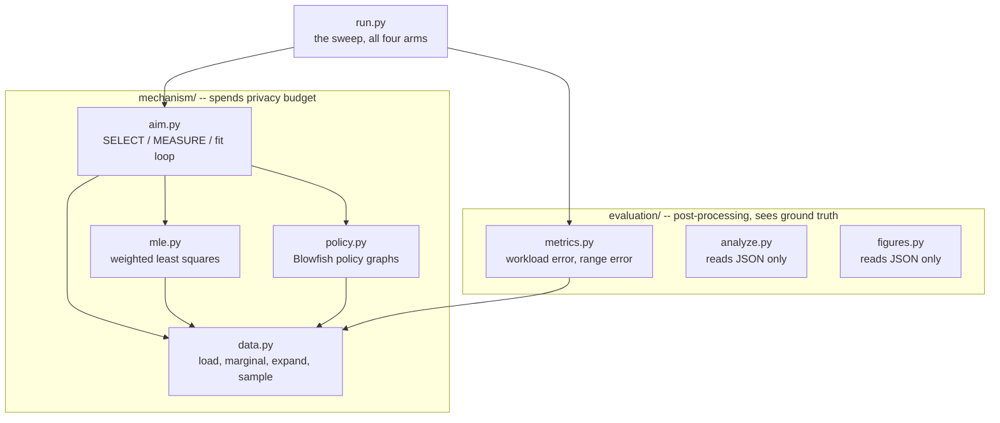
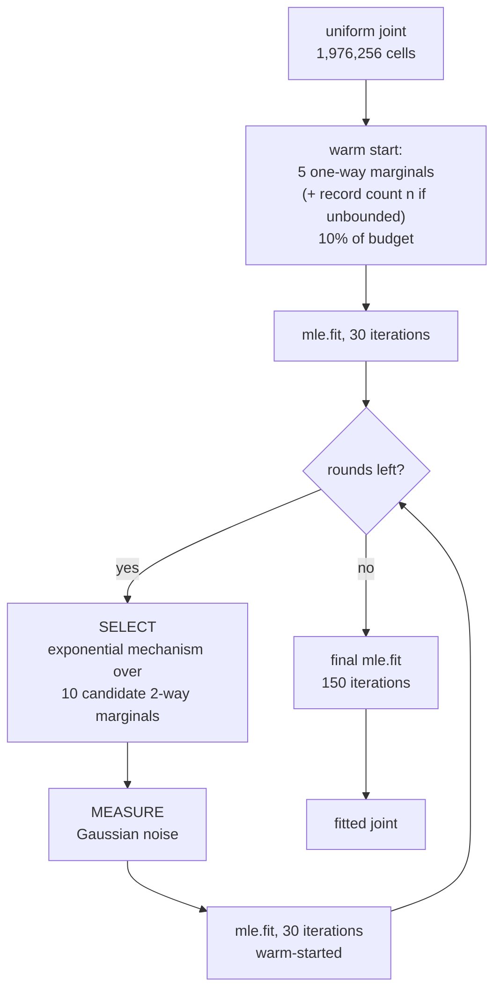
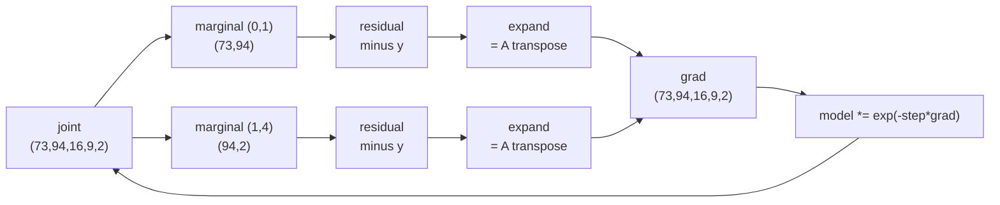

# Code architecture

A minimal AIM on the Adult census data, in four arms: a 2x2 over the privacy
definition (bounded / unbounded DP) and what is released (the marginal, or
weights on a Blowfish policy graph). Eight modules, 1,083 lines, `numpy` and
nothing else.

Two neighbour relations are supported: **unbounded** (a record is added or
removed, as in AIM) and **bounded** (`n` is fixed and public, and a record
moves between values). `aim.run(..., bounded=)` selects between them.

---

## Layout

```
README.md                  the gist and the headline result
dataset/adult.csv          32,561 records, the only input
docs/
  architecture.md          this file
  experiment-results.md    readings, conclusions and next steps
  policy-aware-aim-spec.md the specification
  figures/                 SVGs, written by figures.py
  papers/                  the source papers
experiment/
  mechanism/               the DP algorithm -- data.py, policy.py, mle.py, aim.py
  evaluation/              scoring -- metrics.py, analyze.py, figures.py
  run.py                   the harness, the only thing importing both
  results/                 sweep.json, written by run.py
```

The split is the **privacy boundary**, not just tidiness. `mechanism/` is what
would ship: it reads the real data and spends the budget. `evaluation/` reads
ground truth to score the output, which in a real deployment you could not do
at all — there would be nothing to compare against.

The dependency runs one way only. `evaluation/` imports the domain from
`mechanism/data.py`; nothing in `mechanism/` imports `evaluation/`. That is
checkable, and the mechanism runs with `evaluation/` off the path entirely:

```bash
PYTHONPATH=experiment/mechanism .venv/bin/python -c "
import aim, data
_, true = data.load()
est, picked = aim.run(true, 0.16, 0, use_policy=True)"
```

Everything runs from the **project root**, with

```
PYTHONPATH=experiment/mechanism:experiment/evaluation
```

`.vscode/settings.json` sets the same two paths for the editor and for new
integrated terminals. Paths inside the code are relative to the project root.

---

## Module map

Arrows mean *imports*.



Every arrow crossing the boundary points **into** `mechanism/`, never out.

`data.py` has no internal dependencies — it owns the joint's shape, so the
helpers every other module needs (`marginal`, `expand`) live there rather than
in `aim.py`. That is also why `evaluation/metrics.py` reaches into
`mechanism/` for the domain: scoring has to speak the same coordinates the
mechanism produced.

| side | module | lines | responsibility |
|---|---|---|---|
| mechanism | `data.py` | 81 | Load Adult into a dense joint histogram; marginalise, expand, sample |
| mechanism | `policy.py` | 269 | Blowfish policy graphs: build, transform, sensitivity |
| mechanism | `mle.py` | 49 | Fit a joint to a set of noisy measurements by weighted least squares |
| mechanism | `aim.py` | 187 | The AIM loop: warm start, then SELECT / MEASURE / refit |
| evaluation | `metrics.py` | 69 | Two metrics: 3-way workload error, and range error by interval width |
| evaluation | `analyze.py` | 122 | Turn `sweep.json` into tables, the 2x2 side by side |
| evaluation | `figures.py` | 227 | Turn `sweep.json` into the report's SVGs |
| harness | `run.py` | 79 | Sweep over budgets, arms and seeds; writes `sweep.json` |

---

## The data vector

Everything rests on representing the database as a **histogram over the
domain** — one count per possible record, not one row per actual record:

```
age(73) x hours(94) x education.num(16) x workclass(9) x income(2)
  = 1,976,256 cells,  16 MB dense
```

Its length is a property of the domain, not of the 32,561 records; only 13,839
cells are non-empty. The payoff is that every counting query becomes a **dot
product**, which is what makes marginals linear and the estimation problem
convex.

The dense joint is also why no graphical model is needed. 16 MB fits, so
inference runs to convergence and nothing is confounded by model approximation
error. Past roughly 20M cells this design would need Private-PGM proper.

---

## One AIM run



### Budget

Tracked in zCDP throughout, because it composes by addition.

| step | share | mechanism | cost |
|---|---|---|---|
| warm start | 10%, split **6** ways unbounded / **5** bounded | Gaussian, `sigma_warm` | `rho = 1/(2 sigma^2)` each |
| SELECT, per round | 45% / rounds | exponential, `eps` | `rho = eps^2/8` |
| MEASURE, per round | 45% / rounds | Gaussian, `sigma_meas` | `rho = 1/(2 sigma^2)` |

The warm start covers the 5 one-way marginals, **and the record count `n` under
unbounded DP** — there `n` is exactly what differs between neighbours, so it is
not public and has to be measured (sensitivity 1, since no other edge changes
the total), and `mle.fit` receives the noisy `n_hat` rather than `true.sum()`.
Under bounded DP `n` is public, the warm start splits 5 ways instead of 6, and
the true total is used.

Only these three touch the data. `mle.fit` and everything downstream are
post-processing, so they are free. All four arms spend exactly the same `rho`;
what differs is the neighbour relation and what is released.

### MEASURE

```python
return x + rng.normal(0, sigma * sensitivity(bounded), size=x.shape)
```

`aim.sensitivity` is the L2 sensitivity of a raw marginal, and it depends on the
neighbour relation: **1** unbounded, since adding or removing one record moves
`x` by `e_u`; **sqrt(2)** bounded, since `n` is fixed so a record moves and `x`
changes by `e_u - e_v`.

The key property is that **the whole marginal costs the same as a single cell**
— every record contributes a count of one to exactly one cell, so the noise
level does not depend on how many cells the marginal has. That is why AIM
measures entire marginals rather than individual queries.

### SELECT

AIM's quality score, equation (1) of the paper, with all workload weights 1:

```
q_r = ||M_r(D) - M_r(model)||_1  -  sqrt(2/pi) * sigma * Delta * penalty
```

The first term is how badly the current model explains marginal `r`. The second
is what measuring it would cost anyway, so large marginals are discounted where
noise would swamp the gain.

`aim.cost` supplies `(Delta, penalty)` for whichever arm is running —
`(sensitivity(bounded), cell count)` for stock, `(G.delta, G.penalty)` under a
policy. Stock is
the special case where the only edges are the bottom ones, so one formula
serves both.

The score's own sensitivity differs by arm, and `aim.score_sensitivity` returns
it: **1 for stock**, because add/remove moves one cell by one, so one L1 term
moves by one; **2 under a policy**, because a policy also admits substitution
along a graph edge, which moves two cells.

**The workload does not appear here.** AIM's score is `w_r × (…)`, weighting a
candidate by its workload relevance; every `w_r` is 1 in this implementation and
`CANDIDATES` is hardcoded to all ten 2-way marginals. `metrics.THREE_WAY` — the
workload — lives in `evaluation/` and is never imported by `mechanism/`. So
SELECT measures whatever the model currently explains worst, with no channel by
which the queries you care about could influence it. See spec §11.

---

## How marginals of different shapes are fitted together

This is the whole of `mle.py`, and the one idea worth internalising.

There is only ever **one unknown**: the joint. Each measurement is a linear
function of it, `y_r = A_r x`, where `A_r` sums out the axes not in `r`. So a
set of measurements is one over-determined linear system, and the fit minimises

```
sum_r  || (A_r x - y_r) / scale_r ||^2
```

The gradient of the `r`-th term is `A_r^T (A_r x - y_r)`. `A_r` maps the joint
down to a marginal; `A_r^T` maps a marginal-shaped residual back up to the
joint by **broadcasting over the summed-out axes** — which is exactly what
`data.expand` does. So residuals of every shape land in the same cell-shaped
gradient and are summed:



Marginals that share an axis meet on the same cells and negotiate; that shared
axis is the only coupling between them.

Two consequences of the **multiplicative** update:

- Counts stay positive for free, no clipping.
- `grad` is a sum of terms each constant along the un-measured axes, so
  starting from uniform keeps `log(model)` in the span of the measured
  marginals — the model is always **log-linear**. That is Private-PGM's model
  class, reached without building a junction tree.

Anything not pinned down by a measured marginal comes out at its
**maximum-entropy** value. Measure `age x workclass` and `workclass x income`
and the fit returns age and income conditionally independent given workclass.
That is the model class, not a bug — and it is why SELECT matters.

The fit does not converge tightly, and does not need to. At `rho=0.04` a
measured marginal carries `sigma * sqrt(2/pi)` = **13.3 records of noise per
cell** in expectation, so driving the fit residual much below that would be
fitting noise.

Under a policy the residual is taken in **edge space**, where the noise
actually is and where it stays isotropic, then mapped back to cells. A missing
`graphs[S]` means a stock measurement, so both kinds mix in one fit.

---

## The policy arm

Full detail is in `policy-aware-aim-spec.md`. What the code does:

A **Blowfish policy** is one graph per attribute. An edge `(u,v)` promises that
values `u` and `v` stay indistinguishable — and *only* the pairs you draw are
promised, unlike standard DP, which promises every pair. Fewer promises, less
noise. Attributes combine by the graph Cartesian product: two cells are
adjacent iff they differ on exactly one axis and that axis's two values are
joined.

| attribute | policy | graph |
|---|---|---|
| age | threshold, θ=7 | within 7 years |
| hours.per.week | threshold, θ=8 | within 8 hours |
| education.num | threshold, θ=2 | within 2 levels |
| workclass | partition, 4 blocks | complete inside a block, nothing across |
| income | full protection | complete graph `K_2` |

Bottom edges are added universally on top of these, so a full-protection axis
carries both `K_k` and its bottom edges.

### The transform

Design paper, Theorem 4.1: `W x = W_G x_G`, where `x_G = P_G^-1 x` and
`W_G = W P_G`. Run a *stock* Gaussian mechanism on `(W_G, x_G)` and you get the
Blowfish guarantee on `(W, x)`. That is why the policy lands in MEASURE and
nowhere else structurally.

`P_G` is the signed vertex-edge incidence matrix — one row per cell, one column
per edge, `+1`/`-1` at the endpoints — and its right inverse is
`P_G^-1 = P_G^T (P_G P_G^T)^-1` (Design paper, Lemma 4.8).

### How it is computed

`P_G` is **never built**. For `age x hours` it would be 6,862 x 104,532, or
5.74 GB, of which over 99.9% is zeros — every column holds at most two
non-zeros. Instead `Graph` keeps two arrays, `U` and `V`, holding each edge's
endpoints — 1.7 MB, the same information. Both matrix products become index
operations:

| operation | implemented as | cost |
|---|---|---|
| `P_G^T z` | `z[U] - z[V]` (gather) | O(edges) |
| `P_G r` | `bincount(U,r) - bincount(V,r)` (scatter) | O(edges) |

What *is* built densely is `L = P_G P_G^T`, the grounded Laplacian — diagonal =
degree, `-1` where two cells are joined — and its inverse `Z`. That is
cells x cells, so 377 MB and about 6 seconds for the worst case, computed once
and cached. The transform is then two steps:

```
z    = Z @ x        levels
x_G  = z[U] - z[V]  differences along each edge
```

For a **pure** line graph this is exactly the cumulative histogram (Design
paper, Example 4.1) — verified on `education.num`, where a path graph with one
end grounded reproduces the suffix sums.

How close the deployed graphs come to that depends on the bottom edges. Under
**bounded** there is one ground per component, nothing inside a range touches
it, and levels accumulate much as the textbook case predicts — a range query's
edge count saturates rather than tracking the width. Under **unbounded** every
cell has its own link to ground, so levels stay local and the edge count grows
with width. Spec §9.1 has the counts.

### Bottom, and why nothing is grounded

The graph carries an extra vertex, **bottom**, meaning "this record is
absent". Every cell is joined to it, and the Design paper's Case I
says a bottom-edge contributes a column with a **single `+1`** rather than a
`+1/-1` pair. Bottom is simply vertex `k`, pinned at level zero.

That makes `L = P_G P_G^T = L_graph + I`, which is positive definite, so the
matrix is invertible as it stands. There is no rank deficiency, nothing to
ground, and no per-component bookkeeping. `P_G x_G` returns **every** cell.

The same formula still computes the sensitivity, because bottom reads as zero:
a bottom-edge column gives simply `Z[u,u]`.

### Sensitivity

`Delta_2` is the max column L2 norm of `P_G^-1 P_G`. Expanding that column
collapses it to the **effective resistance** of the edge, so it is three array
lookups in `Z` rather than a matrix product. The effective-resistance framing is
ours rather than the papers'; `policy.py` verifies it against the direct matrix
computation.

| marginal | cells | bounded edges | bounded `Delta_2` | unbounded edges | unbounded `Delta_2` |
|---|---|---|---|---|---|
| age | 73 | 484 | 0.4872 | 556 | 0.4604 |
| hours.per.week | 94 | 717 | 0.4604 | 810 | 0.4376 |
| education.num | 16 | 30 | 0.7862 | 45 | 0.6802 |
| workclass | 9 | 11 | 1.0000 | 16 | 1.0000 |
| income | 2 | 2 | 1.0000 | 3 | 0.8165 |
| age x hours | 6,862 | 97,671 | 0.3557 | 104,532 | 0.3444 |

Edge counts include the bottom edges: `k` of them under unbounded (one per
cell), one per connected component under bounded — so `workclass`, whose four
blocks are four components, carries 4 rather than 9.

`Delta_2` calibrates noise per released number. It falls under a policy while
the number of released values rises — age publishes 556 numbers instead of 73 —
so both factors enter the error of any reconstruction.

## Key invariants

| invariant | where | why it matters |
|---|---|---|
| joint sums to 32,561; income splits 24,720 / 7,841 | `data.py` self-test | preprocessing is correct |
| nothing in `mechanism/` imports `evaluation/` | `grep -rn -e metrics -e analyze experiment/mechanism/` | the privacy boundary holds |
| stock arm gives age-1way 0.0323 and `(0,2,4)` 0.2904 at `rho=0.04`, seed 0 | `aim.py` smoke test | the mechanism has not drifted |
| `L` equals `L_graph + I` | `policy.py` algebra check | bottom contributes exactly the identity |
| `P_G x_G` returns every cell exactly | `policy.py` self-test | the transform is lossless and nothing is grounded |
| every metric falls as `rho` rises | `analyze.py` output | budget is actually buying utility |

---

## Running it manually

All commands from the **project root**, with

```bash
export PYTHONPATH=experiment/mechanism:experiment/evaluation
```

### 1. Environment

Needs `numpy`. Python 3.14 here; no `pip` on the system interpreter, so
bootstrap a venv:

```bash
python3 -m venv .venv
.venv/bin/python -m pip install --quiet --upgrade pip
.venv/bin/python -m pip install --quiet numpy
```

### 2. Data self-test — seconds

```bash
.venv/bin/python experiment/mechanism/data.py
```

Expect `total 32561.0` and the income split above.

### 3. Policy self-test — about 10 seconds

```bash
.venv/bin/python experiment/mechanism/policy.py
```

Prints the sensitivity table, the 2-way candidates and a round-trip check.
`age x hours` takes ~6s and 377 MB for `Z`; everything else is instant.

### 4. End-to-end smoke test — about 4 minutes

```bash
.venv/bin/python experiment/mechanism/aim.py
```

Two budgets x two arms, seed 0. Expect:

```
rho=0.01    policy=False   52.9s  age-1way L1=0.0608  3way L1=0.3086  distinct=4
rho=0.01    policy=True    49.6s  age-1way L1=0.0943  3way L1=0.3225  distinct=3
rho=0.04    policy=False   55.8s  age-1way L1=0.0323  3way L1=0.2904  distinct=5
rho=0.04    policy=True    54.6s  age-1way L1=0.0543  3way L1=0.2948  distinct=5
```

These are the regression check — they must reproduce exactly.

### 5. The sweep — about an hour

```bash
.venv/bin/python experiment/run.py
```

5 budgets x 4 arms x 5 seeds = 100 runs. Writes `experiment/results/sweep.json`
after each budget block, so partial results survive an interrupt. Redirect
stdout if you background it:

```bash
nohup .venv/bin/python experiment/run.py \
  > experiment/results/sweep.log 2>&1 &
```

### 6. The tables and figures

```bash
.venv/bin/python experiment/evaluation/analyze.py
.venv/bin/python experiment/evaluation/figures.py     # -> docs/figures/*.svg
```

Both read `sweep.json` only, so either can be rerun without the mechanism on
the path.

### Changing the experiment

| to change | edit |
|---|---|
| budgets, seeds, arms | `run.py` top constants |
| rounds, fit iterations, learning rate | `aim.run(rounds=, iters=)`, `mle.fit(lr=)` |
| budget split across steps | `aim.run`, the `rho_warm` / `rho_round` block |
| candidate set or workload | `aim.CANDIDATES`, `metrics.THREE_WAY` |
| the policy itself | `policy.POLICY` — one line per attribute |
| the neighbour relation | `aim.SENSITIVITY`, `aim.score_sensitivity`, and the bottom-edge block in `policy.Graph.__init__` |
| which attributes are in play | `mechanism/data.py` — `ATTRS`, `SIZES`, the loader, and `policy.POLICY` |
| a metric | `evaluation/metrics.py`, then add it to `run.evaluate` |

Adding an attribute multiplies the joint's size. Past roughly 20M cells the
dense representation stops being viable and this design needs a graphical
model, which is the point at which Private-PGM proper becomes worth using. The
policy side has its own ceiling: `Z` is cells x cells dense, so a marginal much
past ~10,000 cells stops fitting comfortably.
