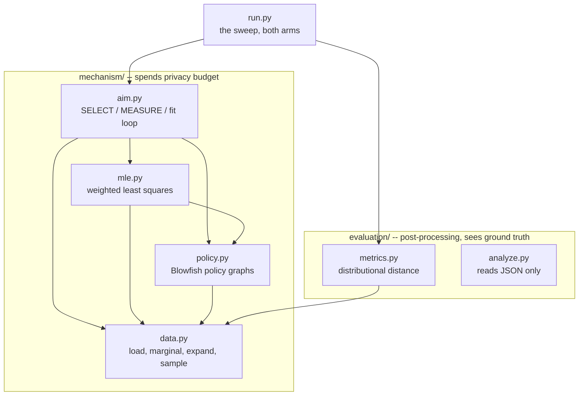
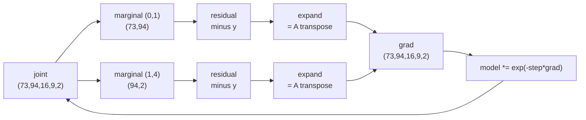

# Code architecture

A minimal AIM on the Adult census data, in two arms: standard differential
privacy, and a Blowfish policy. Seven modules, 793 lines, `numpy` and nothing
else.

---

## Layout

```
dataset/adult.csv          32,561 records, the only input
docs/
  architecture.md          this file
  policy-aware-aim-spec.md the specification
  papers/                  the source papers
experiment/
  mechanism/               the DP algorithm -- data.py, policy.py, mle.py, aim.py
  evaluation/              scoring -- metrics.py, analyze.py
  run.py                   the harness, the only thing importing both
  results/                 sweep.json, written by run.py
archive/                   superseded results and documents, read by nothing
```

The split is the **privacy boundary**, not just tidiness. `mechanism/` is what
would ship: it reads the real data and spends the budget. `evaluation/` reads
ground truth to score the output, which in a real deployment you could not do
at all — there would be nothing to compare against.

The dependency runs one way only. `evaluation/` imports the domain from
`mechanism/data.py`; nothing in `mechanism/` imports `evaluation/`. That is
checkable, and the mechanism runs with `evaluation/` off the path entirely:

```bash
PYTHONPATH=experiment/mechanism .venv/bin/python -c "
import aim, data
_, true = data.load()
est, picked = aim.run(true, 0.16, 0, use_policy=True)"
```

Everything runs from the **project root**, with

```
PYTHONPATH=experiment/mechanism:experiment/evaluation
```

`.vscode/settings.json` sets the same two paths for the editor and for new
integrated terminals. Paths inside the code are relative to the project root.

---

## Module map

Arrows mean *imports*.



Every arrow crossing the boundary points **into** `mechanism/`, never out.

`data.py` has no internal dependencies — it owns the joint's shape, so the
helpers every other module needs (`marginal`, `expand`) live there rather than
in `aim.py`. That is also why `evaluation/metrics.py` reaches into
`mechanism/` for the domain: scoring has to speak the same coordinates the
mechanism produced.

| side | module | lines | responsibility |
|---|---|---|---|
| mechanism | `data.py` | 81 | Load Adult into a dense joint histogram; marginalise, expand, sample |
| mechanism | `policy.py` | 256 | Blowfish policy graphs: build, transform, sensitivity |
| mechanism | `mle.py` | 54 | Fit a joint to a set of noisy measurements by weighted least squares |
| mechanism | `aim.py` | 150 | The AIM loop: warm start, then SELECT / MEASURE / refit |
| evaluation | `metrics.py` | 88 | How far the fitted joint is from the true one |
| evaluation | `analyze.py` | 94 | Turn `sweep.json` into tables, stock vs policy |
| harness | `run.py` | 70 | Sweep over budgets, arms and seeds; writes `sweep.json` |

---

## The data vector

Everything rests on representing the database as a **histogram over the
domain** — one count per possible record, not one row per actual record:

```
age(73) x hours(94) x education.num(16) x workclass(9) x income(2)
  = 1,976,256 cells,  16 MB dense
```

Its length is a property of the domain, not of the 32,561 records; only 13,839
cells are non-empty. The payoff is that every counting query becomes a **dot
product**, which is what makes marginals linear and the estimation problem
convex.

The dense joint is also why no graphical model is needed. 16 MB fits, so
inference runs to convergence and nothing is confounded by model approximation
error. Past roughly 20M cells this design would need Private-PGM proper.

---

## One AIM run


### Budget

Tracked in zCDP throughout, because it composes by addition.

| step | share | mechanism | cost |
|---|---|---|---|
| warm start | 10%, split 5 ways | Gaussian, `sigma_warm` | `rho = 1/(2 sigma^2)` each |
| SELECT, per round | 45% / rounds | exponential, `eps` | `rho = eps^2/8` |
| MEASURE, per round | 45% / rounds | Gaussian, `sigma_meas` | `rho = 1/(2 sigma^2)` |

Only these three touch the data. `mle.fit` and everything downstream are
post-processing, so they are free. Both arms spend exactly the same `rho`;
what differs is what it buys.

### MEASURE

```python
return x + rng.normal(0, sigma * np.sqrt(2.0), size=x.shape)
```

`sqrt(2)` is the bounded-DP L2 sensitivity of a marginal: changing one record
moves it from cell `u` to cell `v`, so `x` changes by `e_u - e_v`, whose norm
is `sqrt(2)`.

The key property is that **the whole marginal costs the same as a single cell**
— every record contributes a count of one to exactly one cell, so the noise
level does not depend on how many cells the marginal has. That is why AIM
measures entire marginals rather than individual queries.

### SELECT

AIM's quality score, equation (1) of the paper, with all workload weights 1:

```
q_r = ||M_r(D) - M_r(model)||_1  -  sqrt(2/pi) * sigma * Delta * penalty
```

The first term is how badly the current model explains marginal `r`. The second
is what measuring it would cost anyway, so large marginals are discounted where
noise would swamp the gain. `q_r` has sensitivity 2, which is the `2*Delta` in
the exponential mechanism's exponent.

`aim.cost` supplies `(Delta, penalty)` for whichever arm is running —
`(sqrt(2), cell count)` for stock, `(G.delta, G.penalty)` under a policy. Stock
is the special case `P_G = I`, so one formula serves both.

---

## How marginals of different shapes are fitted together

This is the whole of `mle.py`, and the one idea worth internalising.

There is only ever **one unknown**: the joint. Each measurement is a linear
function of it, `y_r = A_r x`, where `A_r` sums out the axes not in `r`. So a
set of measurements is one over-determined linear system, and the fit minimises

```
sum_r  || (A_r x - y_r) / scale_r ||^2
```

The gradient of the `r`-th term is `A_r^T (A_r x - y_r)`. `A_r` maps the joint
down to a marginal; `A_r^T` maps a marginal-shaped residual back up to the
joint by **broadcasting over the summed-out axes** — which is exactly what
`data.expand` does. So residuals of every shape land in the same cell-shaped
gradient and are summed:



Marginals that share an axis meet on the same cells and negotiate; that shared
axis is the only coupling between them.

Two consequences of the **multiplicative** update:

- Counts stay positive for free, no clipping.
- `grad` is a sum of terms each constant along the un-measured axes, so
  starting from uniform keeps `log(model)` in the span of the measured
  marginals — the model is always **log-linear**. That is Private-PGM's model
  class, reached without building a junction tree.

Anything not pinned down by a measured marginal comes out at its
**maximum-entropy** value. Measure `age x sex` and `sex x income` and the fit
returns age and income conditionally independent given sex. That is the model
class, not a bug — and it is why SELECT matters.

The fit does not converge tightly, and does not need to: at `rho=0.04` the
measurement itself sits about 2,060 in L1 away from the truth, so driving the
fit residual below that would be fitting noise.

Under a policy the residual is taken in **edge space**, where the noise
actually is and where it stays isotropic, then mapped back to cells. A missing
`graphs[S]` means a stock measurement, so both kinds mix in one fit.

---

## The policy arm

Full detail is in `policy-aware-aim-spec.md`. What the code does:

A **Blowfish policy** is one graph per attribute. An edge `(u,v)` promises that
values `u` and `v` stay indistinguishable — and *only* the pairs you draw are
promised, unlike standard DP, which promises every pair. Fewer promises, less
noise. Attributes combine by the graph Cartesian product: two cells are
adjacent iff they differ on exactly one axis and that axis's two values are
joined.

| attribute | policy | graph |
|---|---|---|
| age | threshold, θ=7 | within 7 years |
| hours.per.week | threshold, θ=8 | within 8 hours |
| education.num | threshold, θ=2 | within 2 levels |
| workclass | partition, 4 blocks | complete inside a block, nothing across |
| income | full protection | complete graph `K_2` |

Note spec §5.2 says `I_k` for a full-protection axis, which contradicts §4.1's
complete graph. `I_k` is the paper's Case I ⊥-star construction, i.e. the
*unbounded* setting, while §4.1 and §6.3 commit to bounded DP. The code follows
§4.1. It barely matters here — `income` is the only full-protection attribute
and `k=2`, so `K_2` is a single edge.

### The transform

Design paper, Theorem 4.1: `W x = W_G x_G`, where `x_G = P_G^-1 x` and
`W_G = W P_G`. Run a *stock* Gaussian mechanism on `(W_G, x_G)` and you get the
Blowfish guarantee on `(W, x)`. That is why the policy lands in MEASURE and
nowhere else structurally.

`P_G` is the signed vertex-edge incidence matrix — one row per cell, one column
per edge, `+1`/`-1` at the endpoints — and its right inverse is
`P_G^-1 = P_G^T (P_G P_G^T)^-1` (Design paper, Lemma 4.8).

### How it is computed

`P_G` is **never built**. For `age x hours` it would be 6,861 x 97,670, or
5.36 GB, of which 99.97% is zeros — every column holds exactly two non-zeros.
Instead `Graph` keeps two arrays, `U` and `V`, holding each edge's endpoints —
1.6 MB, the same information. Both matrix products become index operations:

| operation | implemented as | cost |
|---|---|---|
| `P_G^T z` | `z[U] - z[V]` (gather) | O(edges) |
| `P_G r` | `bincount(U,r) - bincount(V,r)` (scatter) | O(edges) |

What *is* built densely is `L = P_G P_G^T`, the grounded Laplacian — diagonal =
degree, `-1` where two cells are joined — and its inverse `Z`. That is
cells x cells, so 377 MB and 4 seconds for the worst case, computed once and
cached. The transform is then two steps:

```
z    = Z @ x        levels
x_G  = z[U] - z[V]  differences along each edge
```

which for a line graph is exactly the cumulative histogram (Design paper,
Example 4.1).

### Grounding

The plain incidence matrix is rank deficient — the all-ones vector spans the
null space of each component — so one vertex per connected component is folded
into a bottom symbol (Design paper, Case II; the per-component generalisation
is ours, since the paper assumes a connected graph). Those cells are recovered
by subtraction.

This is free. A record can never leave its component, so component totals are
identical in any two neighbouring databases: sensitivity 0. Here the only
partitioned attribute is `workclass`, so that free information is exactly its
four block totals, `[4351, 22696, 3657, 1857]`, and `policy.renormalise` pins
them in place of the plain `model *= n/model.sum()`.

Note the grounded `L` is *not* the Laplacian of the remaining subgraph: its
diagonal still counts edges running to the drain. That is what makes it
invertible.

### Sensitivity

`Delta_2` is the max column L2 norm of `P_G^-1 P_G`. Expanding that column
collapses it to the **effective resistance** of the edge, so it is three array
lookups in `Z` rather than a matrix product. This framing is ours — neither
"Laplacian" nor "effective resistance" appears in any of the six papers — but
it is verified both ways, and against the spec's independent reference values.

| marginal | cells | edges | `Delta_2` |
|---|---|---|---|
| age | 73 | 483 | 0.4872 |
| hours.per.week | 94 | 716 | 0.4604 |
| education.num | 16 | 29 | 0.7862 |
| workclass | 9 | 7 | 1.0000 |
| age x hours | 6,862 | 97,670 | 0.3557 |

**`Delta_2` is not a quality measure.** It falls under a policy, but the number
of released values rises — age publishes 483 numbers instead of 73. The policy
is expected to lose slightly on cell-level accuracy and win on range queries.
Read the ratio per metric, not an overall verdict.

---

## Key invariants

| invariant | where | why it matters |
|---|---|---|
| joint sums to 32,561; income splits 24,720 / 7,841 | `data.py` self-test | preprocessing is correct |
| nothing in `mechanism/` imports `evaluation/` | `grep -rn -e metrics -e analyze experiment/mechanism/` | the privacy boundary holds |
| stock arm gives 0.0380 / 0.2982 at `rho=0.04`, seed 0 | `aim.py` smoke test | the policy code did not disturb standard DP |
| `Delta_2` matches spec §7 to 4 dp; a tree gives exactly 1.0 | `policy.py` self-test | the transform is correct |
| `P_G x_G` returns the kept cells | `policy.py` self-test | the transform is lossless |
| every metric falls as `rho` rises | `analyze.py` output | budget is actually buying utility |

---

## Running it manually

All commands from the **project root**, with

```bash
export PYTHONPATH=experiment/mechanism:experiment/evaluation
```

### 1. Environment

Needs `numpy`. Python 3.14 here; no `pip` on the system interpreter, so
bootstrap a venv:

```bash
python3 -m venv .venv
.venv/bin/python -m pip install --quiet --upgrade pip
.venv/bin/python -m pip install --quiet numpy
```

### 2. Data self-test — seconds

```bash
.venv/bin/python experiment/mechanism/data.py
```

Expect `total 32561.0` and the income split above.

### 3. Policy self-test — about 10 seconds

```bash
.venv/bin/python experiment/mechanism/policy.py
```

Prints the sensitivity table, the 2-way candidates, a round-trip check and the
free block totals. `age x hours` takes ~4s and ~1.3 GB; everything else is
instant.

### 4. End-to-end smoke test — about 4 minutes

```bash
.venv/bin/python experiment/mechanism/aim.py
```

Two budgets x two arms, seed 0. Expect:

```
rho=0.01    policy=False   50.2s  age-1way L1=0.0696  3way L1=0.3280  distinct=4
rho=0.01    policy=True    55.2s  age-1way L1=0.0891  3way L1=0.3326  distinct=3
rho=0.04    policy=False   57.0s  age-1way L1=0.0380  3way L1=0.2982  distinct=5
rho=0.04    policy=True    64.4s  age-1way L1=0.0394  3way L1=0.2941  distinct=5
```

The stock rows are the regression check — they must reproduce exactly.

### 5. The sweep — about an hour

```bash
.venv/bin/python experiment/run.py
```

5 budgets x 2 arms x 5 seeds = 50 runs. Writes `experiment/results/sweep.json`
after each budget block, so partial results survive an interrupt. Redirect
stdout if you background it:

```bash
nohup .venv/bin/python experiment/run.py \
  > experiment/results/sweep.log 2>&1 &
```

### 6. The tables

```bash
.venv/bin/python experiment/evaluation/analyze.py
```

### Changing the experiment

| to change | edit |
|---|---|
| budgets, seeds, arms | `run.py` top constants |
| rounds, fit iterations, learning rate | `aim.run(rounds=, iters=)`, `mle.fit(lr=)` |
| budget split across steps | `aim.run`, the `rho_warm` / `rho_round` block |
| candidate set or workload | `aim.CANDIDATES`, `metrics.THREE_WAY` |
| the policy itself | `policy.POLICY` — one line per attribute |
| which attributes are in play | `mechanism/data.py` — `ATTRS`, `SIZES`, the loader, and `policy.POLICY` |
| a metric | `evaluation/metrics.py`, then add it to `run.evaluate` |

Adding an attribute multiplies the joint's size. Past roughly 20M cells the
dense representation stops being viable and this design needs a graphical
model, which is the point at which Private-PGM proper becomes worth using. The
policy side has its own ceiling: `Z` is cells x cells dense, so a marginal much
past ~10,000 cells stops fitting comfortably.
