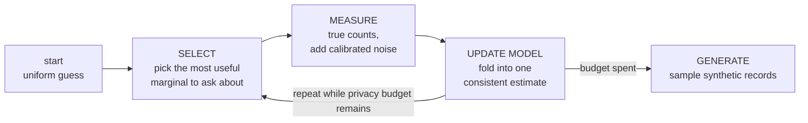
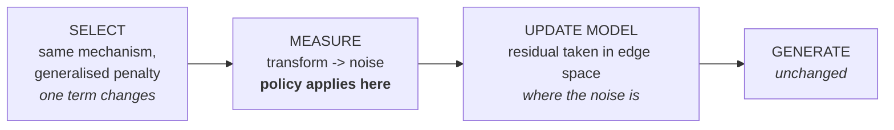

# Policy-Aware AIM on the Adult dataset

Specification of the built system: a Blowfish-policy-aware variant of AIM, run
against stock AIM on the Adult census dataset under matched privacy budget.

This document describes what exists. Results are in `experiment-results.md`;
module layout and mechanics are in `architecture.md`.

### Contents

- [1. Objective and the claim under test](#1-objective-and-the-claim-under-test)
- [2. Background: AIM in one page](#2-background-aim-in-one-page)
- [3. Data and preprocessing](#3-data-and-preprocessing)
- [4. The policy](#4-the-policy)
- [5. The mechanism: P_G](#5-the-mechanism-p_g)
- [6. Algorithm](#6-algorithm)
- [7. Sensitivity](#7-sensitivity)
- [8. Experiment protocol](#8-experiment-protocol)
- [9. Metrics](#9-metrics)
- [10. Disclosure](#10-disclosure)
- [11. Known limitations](#11-known-limitations)
- [12. Appendix: reference values](#12-appendix-reference-values)

## 1. Objective and the claim under test

Build a variant of AIM whose privacy guarantee is a **Blowfish policy** rather
than standard differential privacy, and determine what that buys and what it
costs on real data.

**The claim under test:** at matched privacy budget, policy-aware AIM is
**no worse than stock AIM on cell-level marginal accuracy** and **measurably
better on range-shaped queries over ordinal attributes**.

The first half is a no-regression check, the second is the payoff. Both must be
reported.

Whether an equal-`rho` comparison is symmetric depends on the baseline the
policy is measured against, which is why the experiment runs both bounded and
unbounded DP (Section 8). Readings are in `experiment-results.md`; what they
mean is in `conclusion.md`.

## 2. Background: AIM in one page

AIM generates DP synthetic data by repeatedly measuring small marginals under
noise and fitting a model to the noisy answers. It never touches individual
records — only **marginals**, small cross-tabs. The real `workclass × income`
marginal is a 9×2 table of counts; that is the kind of object AIM measures.



Over the published algorithm, AIM adds a cheap head start measuring all 1-way
marginals; a cap on candidate marginals that would make the model intractable;
a selection score weighing workload relevance against remaining budget; and
adaptive pacing that resizes rounds. **This implementation keeps the first and
the third, and fixes the round count instead of pacing adaptively.**

## 3. Data and preprocessing

Source: `dataset/adult.csv`, 32,561 records. **Five attributes are used**, and
preprocessing is deterministic and identical across all four arms.

| attribute | meaning | domain | policy |
|---|---|---|---|
| `age` | age in years at census time | 73 (17–90) | threshold θ=7 |
| `hours.per.week` | hours worked per week | 94 (1–99) | threshold θ=8 |
| `education.num` | education level, ordinal (1=Preschool … 16=Doctorate) | 16 (1–16) | threshold θ=2 |
| `workclass` | type of employer | 9 | partition ×4 |
| `income` | whether income exceeds $50K/yr | 2 | full |

The joint is `73 × 94 × 16 × 9 × 2 = 1,976,256` cells, 16 MB dense. **Small
enough that inference runs to convergence**, so nothing in the comparison is
confounded by model approximation error. That is the reason for the reduced
attribute set.

`income` is fully protected, not treated as a public label.

**Ordinal attributes are indexed by rank among observed values, not by raw
value.** `age` is missing 89 and `hours.per.week` is missing {69, 71, 79, 83,
93}, all single rare points in the tail. Ranking keeps the domains gap-free at
k = 73 and 94; the cost is that one index step is one *observed* value rather
than one year or one hour, which differs only next to those gaps.

**`"?"` in `workclass` is a real category, not a missing value.** The 1,836
people carrying it work fewer hours (31.9 vs 40.9 average) and skew lower-income
(89.6% vs 75.1% at ≤50K). That is genuine reduced labour-force attachment, not
random missingness.

## 4. The policy

A Blowfish policy is a graph `G` per attribute, combined across attributes by
the graph Cartesian product. Two databases are neighbours if one record moves
along a single edge — so an edge `(u,v)` is a promise that values `u` and `v`
stay indistinguishable, and **more edges means stronger protection**. Three
graph types are in play:

| type | construction | meaning |
|---|---|---|
| **Full** | complete graph on the values | any two values indistinguishable — standard-DP strength. No useful notion of "nearby" to exploit. |
| **Threshold** | edges between values within `θ` | protection degrades with distance; graph distance is `⌈|u−v|/θ⌉`. |
| **Partition** | complete within each block, no edges across | within-block detail protected; block membership is not. See Section 10. |

Attributes combine by the graph Cartesian product: two cells are adjacent iff
they differ on exactly one axis, and that axis's two values are joined in its
own graph.

#### 4.1 Values used

| attribute | type | parameter |
|---|---|---|
| `age` | threshold | θ = 7 — ages within 7 observed values indistinguishable |
| `hours.per.week` | threshold | θ = 8 |
| `education.num` | threshold | θ = 2 |
| `workclass` | partition | 4 blocks, below |
| `income` | full | `K₂` |

θ values lean wide rather than minimal: Blowfish range-query error scales as
`log³θ`, so doubling θ costs about 2.3× error for up to 2× the protection
width — not a 1:1 trade.

**`workclass` blocks.** The domain is ordered so blocks are contiguous index
ranges, which is what lets `policy.blocks_graph` take `(lo, hi)` pairs:

| block | indices | values | records |
|---|---|---|---|
| Government | `[0,3)` | Federal-gov (960), State-gov (1,298), Local-gov (2,093) | 4,351 |
| Private | `[3,4)` | Private | 22,696 |
| Self-employed | `[4,6)` | Self-emp-not-inc (2,541), Self-emp-inc (1,116) | 3,657 |
| NotClearlyEmployed | `[6,9)` | Without-pay (14), Never-worked (7), ? (1,836) | 1,857 |

`"?"` is merged into NotClearlyEmployed on the evidence in Section 3.

## 5. The mechanism: P_G

`P_G` is the **signed vertex–edge incidence matrix** of the policy graph: one
row per domain cell, one column per edge, carrying `+1` and `−1` at the two
cells the edge joins. The central result (Design paper, Theorem 4.1) is

> `W·x = W_G·x_G` where `x_G = P_G⁻¹·x` and `W_G = W·P_G`

Running a standard-DP mechanism on `(W_G, x_G)` yields the Blowfish guarantee
on `(W, x)`. The transform is lossless; all error comes from the noise. The
minimum-norm right inverse is `P_G⁻¹ = P_Gᵀ(P_G P_Gᵀ)⁻¹` (Design paper,
Lemma 4.8).

#### 5.1 The bottom vertex, and the two neighbour relations

The graph carries an extra vertex `⊥` meaning "this record is absent". A
bottom-edge contributes a column with a single `+1` rather than a `+1/−1` pair,
and `⊥` itself carries no row, so its level is pinned at zero.

**How many bottom edges exist is the whole difference between the two privacy
definitions**, and it is the only thing `policy.Graph` branches on:

| | bottom edges | `n` | raw-marginal sensitivity |
|---|---|---|---|
| **unbounded** | one per **cell** | measured, not public | 1 |
| **bounded** | one per connected **component** | fixed and public | √2 |

- **unbounded** is the Design paper's **Case I**: a record may appear or vanish
  anywhere, so every cell needs its own edge to `⊥`. `n` is exactly what
  differs between neighbours, so `aim.py` measures it. Every cell also gains a
  direct shortcut to ground, which prevents levels accumulating along an
  ordinal axis (Section 9.1).
- **bounded** grounds one vertex per connected component — the fewest edges
  that keep `L` invertible. Records move rather than appear, so the ground
  edges are a mathematical device rather than a neighbour move, and `Δ₂` is
  taken over the policy edges only.

Either way `P_G P_Gᵀ = L_graph + D_ground` is positive definite, so nothing has
to be grounded by hand and there is no per-component bookkeeping.

**Stock AIM is the special case where the only edges are the bottom ones.**
Then `L = I`, `Z = I`, `Δ₂ = 1`, and the SELECT penalty collapses to the cell
count — the transform reduces to the identity exactly. This is the strongest
available correctness test on the machinery.

#### 5.2 Representation — an explicit edge list

The product graph is materialised as an **explicit edge list** and `L` is
inverted densely. `P_G` itself is never built: every operation is a gather or
scatter over the edge list, so `transform` is `z[U] − z[V]` and its adjoint is
a pair of `bincount`s.

This is affordable at the chosen domain sizes. The worst case is
`age × hours.per.week` — 6,862 cells, 104,532 edges, about 6s to build and
377 MB for `Z`, computed once and cached for the whole sweep. It would not
scale to the full 13-attribute schema, which is the other reason for the
reduced attribute set.

Graphs are **data independent**: they depend only on the policy, so building
them costs no privacy budget and they can be cached freely.

## 6. Algorithm



#### 6.1 MEASURE — the structural change

Stock AIM releases the marginal itself. Under a policy the released quantity is
`x_G = P_G⁻¹x` — **weights on the policy graph's edges, not counts on its
cells** — and the noise goes there, where it stays isotropic.

```
if no policy:  release  x   + N(0, sigma * Delta_stock)   # 1 unbounded, sqrt(2) bounded
else:          release  x_G + N(0, sigma * Delta_2(G))
```

**The measurement is never reconstructed back to cell space.** Not because the
estimate would differ — for a single marginal it would not. Least squares in
edge space solves `(AᵀA)·pred = Aᵀy` with `A = P_G⁻¹`, and since `AᵀA = Z` that
reduces to `pred = P_G y`: the reconstruction is exactly what the fit already
computes implicitly.

The reason is the **weighting**. Measurements are pooled by a single scalar
`1/scale²` each, which is only valid if the noise within a measurement is even
across its entries. On the edges it is. Reconstructed to cells it is not —
the covariance becomes `P_G P_Gᵀ`, unequal and correlated, and one scalar can
no longer describe it. Staying in edge space gets the same estimate *and* keeps
the pooling valid, so the model's prediction is pushed into edge space to meet
the measurement rather than the reverse.

Every record contributes a count of one to exactly one cell, so a whole
marginal costs the same as a single cell would. That is why AIM measures entire
marginals, and why the shape of the marginal does not affect the noise level.

#### 6.2 SELECT — one term generalised

AIM's quality score, equation (1):

> `q_r = w_r ( ‖M_r(D) − M_r(model)‖₁ − √(2/π)·σ·n_r )`

The first term is how badly the current model explains marginal `r`. The second
is what measuring it would cost anyway — `√(2/π)·σ` is the expected absolute
error of one Gaussian draw and `n_r` is the cell count — so it discounts
marginals large enough for the noise to swamp the gain. All workload weights
are 1 here.

Under a policy the released quantity is `x_G`, so the penalty must reflect the
actual reconstruction error of the strategy `A_r = P_G⁻¹`:

```
stock:   penalty = n_r
policy:  penalty = sum_i sqrt( inv(A_r^T A_r)[i,i] )
```

Since `A_rᵀA_r = Z·P_G P_Gᵀ·Z = Z`, its inverse is `L` and the diagonal is the
vertex degree, so the policy penalty is `sum_i sqrt(deg_i)` — computable
directly from the edge list. It collapses to the cell count when the only edges
are the bottom ones, so stock is again the special case.

**Score sensitivity.** Adding or removing a record moves one cell by 1, so one
L1 term moves by 1. A policy also admits substitution along a graph edge, which
moves two cells by 1 each. Hence `Δ = 1` stock, `Δ = 2` under a policy.

#### 6.3 Inference

Weighted least squares over all measurements so far, by **exponentiated
gradient descent** from a uniform start. Starting from uniform, the
multiplicative update keeps `log(model)` inside the span of the measured
marginals — that is Private-PGM's model class, reached without building a
junction tree, affordable only because the joint is small enough to hold
densely.

Under a policy the residual is taken **in edge space, where the noise is**, and
mapped back to cells by `(P_G⁻¹)ᵀ`. A marginal with no graph is a stock
cell-space measurement, so both kinds mix in one fit. Measurements are weighted
by `1/scale²`, so the warm start and later rounds combine correctly despite
carrying different noise levels.

Repeated measurements of the same marginal are averaged; averaging `k`
equal-variance measurements divides the noise by `√k`.

#### 6.4 Budget

Tracked in **zCDP** throughout. The Gaussian mechanism with noise scale `σ`
costs `rho = 1/(2σ²)`; the exponential mechanism with parameter `ε` costs
`rho = ε²/8`.

| step | share |
|---|---|
| warm start — every 1-way marginal, plus the record count `n` when it is not public | 10%, split equally over the releases: **6** under unbounded DP, **5** under bounded |
| each round — SELECT | 45% / `rounds` |
| each round — MEASURE | 45% / `rounds` |

Budget accounting is otherwise unchanged from AIM: it writes the Gaussian
mechanism as `f(D) + σ·Δ(f)·N(0,I)`, so `σ` multiplies sensitivity and the zCDP
cost is already sensitivity-agnostic. Only the noise scale changes.

## 7. Sensitivity

Neighbouring databases differ by exactly one column of `P_G`, so for a released
quantity `x_G` the L2 sensitivity is

> `Δ₂ = max over edges e of ‖P_G⁻¹·P_G[:,e]‖₂` = max column L2 norm of `P_G⁻¹P_G`

Expanding one column, `‖P_Gᵀ Z c‖² = cᵀZc` — the edge's **effective
resistance**. It is **independent of the data**, computable from the policy
alone at zero privacy cost, and cached per marginal shape.

**Δ₂ is not a quality measure.** It *falls* as θ grows while cell error
*rises*, because widening θ adds edges — and edges do two things at once. More
edges means more parallel paths to `⊥`, which lowers the effective resistance
and so lowers Δ₂. More edges also means literally more numbers to publish. You
cannot have one without the other.

Measured on `age`, varying θ (cell error is `Δ₂ × penalty`, from Section 6.2):

| θ | edges | Δ₂ | total variance | cell error |
|---|---|---|---|---|
| *stock* | *73* | *1.0000* | *73.0* | *73.0* |
| 1 | 145 | 0.7862 | 89.6 | 98.9 |
| 3 | 286 | 0.6104 | 106.6 | 116.4 |
| 7 | 556 | 0.4604 | 117.9 | **126.5** |
| 15 | 1,048 | 0.3384 | 120.0 | 129.5 |

Δ₂ calibrates noise per released number; it says nothing about how many numbers
are released — `age` publishes 556 instead of 73. Both factors enter the cell
error column above.

#### Reference values — 1-way marginals, as deployed

| attribute | k | edges | Δ₂ | SELECT penalty |
|---|---|---|---|---|
| `age` | 73 | 556 | 0.4604 | 274.7 |
| `hours.per.week` | 94 | 810 | 0.4376 | 377.9 |
| `education.num` | 16 | 45 | 0.6802 | 34.3 |
| `workclass` | 9 | 16 | 1.0000 | 14.2 |
| `income` | 2 | 3 | 0.8165 | 2.8 |

Edge counts include one bottom-edge per cell, so they exceed the policy graph's
own edge count by exactly `k`. Stock AIM's corresponding values are `Δ₂ = 1`
and penalty = `k` for every attribute.

**Always state the norm when quoting a gain.** Ratios in variance and in error
differ by a square root, and quoting one for the other overstates the result.
Report **error** ratios, matching the L1 metrics in Section 9, and label any
variance ratio explicitly.

## 8. Experiment protocol

| | |
|---|---|
| **four arms** | a 2x2: {bounded, unbounded} DP x {stock, policy}. Identical preprocessing, workload, hyperparameters and seeds throughout. *Varying one factor at a time is what separates the release from the privacy definition.* |
| **sweep rho** | five zCDP budget points, geometric ×4. *The gain is largest where noise dominates, so one mid-range rho can badly under- or over-sell it.* |
| **5 seeds** | per arm per budget. Both arms run the same seeds, so **every comparison is paired**. *Run-to-run variance in AIM is high enough that single-run numbers carry little information.* |
| **workload** | all 3-way marginals — 10 over 5 attributes, uniform weights. Matches AIM's own evaluation. |
| **candidates** | all 2-way marginals — 10 of them. |
| **scored on** | the fitted joint, not sampled records. See Section 11. |

4 arms × 5 budgets × 5 seeds = **100 runs**, about 79 minutes.

#### 8.1 Budget points

Geometric ×4, centred so the middle point sits near `ε ≈ 1`, the region AIM's
own evaluation occupies. Conversion is `ε = rho + 2√(rho·ln(1/δ))` at
`δ = 10⁻⁹`, **for reference only — the experiment is run and reported in rho**.

| rho | 0.000625 | 0.0025 | 0.01 | 0.04 | 0.16 |
|---|---|---|---|---|---|
| ε @ δ=1e-9 | 0.23 | 0.46 | 0.92 | 1.86 | 3.80 |

#### 8.2 Hyperparameters

Identical across both arms.

| parameter | value |
|---|---|
| rounds | 10, fixed — no adaptive pacing |
| fit iterations | 30 per round, 150 for the final fit |
| learning rate | 0.5, decayed as `lr / (1 + t/100)` across the whole run |
| warm start | all five 1-way marginals plus `n` |
| budget split | Section 6.4 |
| seeds | 0–4 |

## 9. Metrics

Two metrics are computed, and deliberately only two: AIM's own cell-level
metric, and a range-query benchmark. The second is included because AIM has no
metric that is sensitive to ordinal structure, so a cell-wise measure alone
cannot detect what a threshold policy changes either way.

| metric | definition | source |
|---|---|---|
| **Workload error** | mean over all ten 3-way marginals of `‖x_S − x̂_S‖₁ / n` | **AIM** (McKenna et al., VLDB 2022) — its native metric, same 3-way workload |
| **Range error, by width** | `D = cumsum(x̂_a − x_a)`; error of `[lo,hi)` is `|D[hi] − D[lo]|`; averaged within width bands, over every interval on each ordinal attribute | **Blowfish Design paper** (Haney, Machanavajjhala, Ding, 2015) — range queries under threshold policies are its motivating workload |

Neither is invented for this project. AIM supplies the cell-level metric and
has none that can express what a threshold policy changes, so the range
benchmark comes from the Blowfish line the transform itself is taken from.

The first is the no-regression guardrail; a ratio below 0.9× would indicate a
bug in the sensitivity calculation rather than a result. The second is where a
threshold policy is expected to act.

#### 9.1 Why range queries should improve — and how much depends on the relation

The textbook picture is the **prefix-sum** one: if `P_G` held running totals, a
range query would be the difference of its two endpoints, the interior would
cancel, and error would be flat in the width of the range. A pure path graph
with one endpoint grounded does produce exactly that — verified against
`education.num`, where the edge weights come out as the suffix sums
`[32510, 32342, 32009, …]`.

**Whether this construction gets that behaviour depends on how many bottom
edges it has** (Section 5.1). For a range query `q`, the edges actually read are
those where `q[u] ≠ q[v]`. A policy edge qualifies only near the range boundary
— but **a bottom edge inside the range always qualifies**, since `q[u] − 0 = 1`
there. Counting non-zeros of `W_G = q·P_G` on `age` (θ=7):

| range width | stock reads | **bounded** reads | **unbounded** reads |
|---|---|---|---|
| 2 | 2 | 14 | 15 |
| 4 | 4 | 23 | 26 |
| 8 | 8 | **29** | 36 |
| 20 | 20 | **29** | 48 |
| 40 | 40 | **29** | 68 |

- **Bounded** has one ground edge for the whole component, so nothing inside a
  range touches it. The count **saturates at 29** and stops growing: the
  interior cancels and only the boundary is read, which is the textbook
  behaviour.
- **Unbounded** has one bottom edge per cell — 73 of them — so every cell inside
  the range contributes one. The count **keeps growing with width**,
  reinstating the per-cell reading the transform was meant to avoid. Its gain
  cannot come from reading fewer numbers; it reads about as many as stock.

What both share is that each released number is **quieter** — `Δ₂` of 0.4872
bounded and 0.4604 unbounded on `age`, against a stock arm at √2 and 1
respectively (Section 7).

The design implication is a direction, not a magnitude: narrow queries pay the
edge-count overhead without recovering it, while wide ones read enough quieter
numbers to offset it, so any advantage should appear only above some width. θ
sets the scale of that threshold but does not pin it.

**This reasoning is measurement-level only.** Utility is scored on the fitted
joint, and the fit pools ten rounds of measurements across overlapping
marginals in between, so nothing here predicts the measured ratios. It states
why a width threshold should exist at all.

#### 9.2 The benchmark

- **Exhaustive, no sampling.** Every interval on every ordinal attribute — all
  `k(k+1)/2` of them — from a single `cumsum`. Free of sampling variance.
- **Stratified by width**, into bands 1–2, 3–5, 6–10, 11–20, >20, and
  **never pooled**. The policy is worse on narrow intervals and better on wide
  ones, so a pooled average lets the two cancel and reports nothing. That sign
  flip, within one metric, is what the experiment is built to detect.
- **Reported as a ratio per stratum**, never as a single number.

#### 9.3 Diagnostic

Per-run count of distinct marginals SELECT chose. Not a utility metric — it
exists because the generalised penalty is larger for threshold marginals, so
the two arms may not be exploring the same candidates, which would confound the
workload-error comparison.

## 10. Disclosure

A partition graph has no edges across blocks, so taken alone its blocks are
separate connected components — and records in different components are at
infinite graph distance, meaning block membership is disclosed exactly, in the
clear, at no budget. That is the one place a Blowfish policy gives up something
differential privacy never would.

**Whether it happens depends on the neighbour relation**, because that decides
whether the bottom edges are moves an adversary can make or only a device for
grounding `L`.

**Unbounded — it does not happen.** Every cell carries a bottom edge and
add/remove *is* a neighbour move, so `⊥` joins the whole graph. Two databases
differing in one record's `workclass` across a block boundary are not
neighbours directly, but are joined through `⊥` in two steps — a finite factor,
not an infinite one. Block totals cost budget like any other measurement.

| marginal | components without `⊥` | components with `⊥` |
|---|---|---|
| `workclass` | 4 | **1** |
| `workclass × income` | 4 | **1** |
| `age` | 1 | **1** |

**Bounded — it does happen.** `n` is public, so a record cannot appear or
vanish and the ground edges are not neighbour moves; `policy.Graph` excludes
them from `Δ₂` for exactly that reason. The neighbour relation is then the
policy edges alone, and those leave `workclass` in **4 components** with no
path between them. Block membership is disclosed exactly. Five of the fifteen
measured marginals are affected — every one that includes `workclass`:

| marginal | components under bounded DP |
|---|---|
| `workclass` | 4 |
| `age × workclass` | 4 |
| `hours.per.week × workclass` | 4 |
| `education.num × workclass` | 4 |
| `workclass × income` | 4 |

All ten remaining marginals are connected, so only the `workclass` partition
carries this cost. It is a property of pairing a partition policy with bounded
DP, not of the implementation, and it cannot be mitigated by spending more
budget.

**Residual risk.** The policy still declines to protect *coarse* location on
threshold attributes — that is what it is for. An adversary learns age to
within roughly θ more easily than under standard DP. This is a property of the
policy, not of any implementation, and cannot be mitigated by spending more
budget. Quantifying it needs an inference-gap experiment, which has not been
run (Section 11).

## 11. Known limitations

**Utility is scored on the fitted joint, not on sampled records.** Drawing
32,561 records from the *true* joint already costs 3-way L1 0.142 — about half
what the mechanism loses at the top of the budget range — so metrics on sampled
records would spend much of their range measuring the sampler. Two consequences:
the numbers are not directly comparable to published AIM figures, and the effect
of the transform is observed at MEASURE rather than on synthetic records, which
a real deliverable would be. AIM's own ablations suggest a constrained fit
compresses such differences by roughly 3×.

**The workload never reaches the mechanism.** `metrics.THREE_WAY` appears only
in `evaluation/`; nothing in `mechanism/` imports it. AIM's score is
`q_r = w_r(…)`, where `w_r` weights a candidate by its workload relevance —
here every `w_r` is 1, and the candidate set is hardcoded to all ten 2-way
marginals. So SELECT measures whatever the model currently explains worst, with
no channel through which "these are the queries I care about" could reach it.

**SELECT under-picks threshold marginals.** The generalised penalty is ~1.8×
larger for them, so budget steers away from exactly the attributes whose policy
was adopted for range-query quality. This is the same root cause as the item
above: the score is driven by cell-level error alone, so it cannot express the
range-query benefit even in principle. Fixing it properly requires workloads of
general linear queries — an open problem in the AIM paper. Section 9.3's
diagnostic records per-run marginal counts so the effect can be checked.

**The transform is applied where it cannot help.** `use_policy` builds a graph
for *every* measured marginal, including `workclass`, `income` and
`workclass × income` — none of which is ordinal, so no range query is ever
asked of them. Those three cost 1.52× in cell accuracy for no possible return.
`mle.fit` already mixes transformed and untransformed measurements (a missing
`graphs[S]` means a stock measurement), so restricting the transform to
marginals touching an ordinal attribute needs only a change in `aim.run`. Not
done here.

**Width strata are absolute, not θ-normalised.** The bands are the same for all
three ordinal attributes, but θ is 7, 8 and 2, so the predicted crossover falls
in a different band per attribute and `education.num` has no band strictly
below its own threshold. This is why the crossover *location* cannot be checked
against θ; strata of `[1, θ/2] … >4θ` would fix it, and need a re-run.

**Cross-marginal strategy coordination is unsolved.** Each marginal's
measurement is handled well in isolation; coordinating strategy and budget
across the many overlapping marginals AIM selects over a full run is open in
both source papers. Per-marginal strategies are used.

**Not measured.** Downstream utility (TSTR) and the attack / inference gap of
Section 10 were not run.

**Scale.** The dense-inverse, explicit-edge-list construction does not extend to
the full 13-attribute Adult schema. `Z` is cells × cells dense, so
`age × hours.per.week` alone needs 377 MB, and a marginal much past ~10,000
cells stops fitting comfortably.

## 12. Appendix: reference values

Unit tests and regression checks. All values reproduce exactly.

#### Dataset invariants — `data.py` self-test

```
n                = 32561
joint shape      = (73, 94, 16, 9, 2) = 1,976,256 cells
income           = [24720, 7841]                    # <=50K, >50K
workclass        = [960, 1298, 2093, 22696, 2541, 1116, 14, 7, 1836]
age              : 73 distinct, 17..90 (89 absent), quartiles 28 / 37 / 48
hours.per.week   : 94 distinct,  1..99 ({69,71,79,83,93} absent), quartiles 40 / 40 / 45
education.num    : 16 distinct,  1..16, quartiles 9 / 10 / 12
```

#### Policy graphs — `policy.py` self-test

```
                    k    edges   Delta2   penalty
age                73      556   0.4604     274.7
hours.per.week     94      810   0.4376     377.9
education.num      16       45   0.6802      34.3
workclass           9       16   1.0000      14.2
income              2        3   0.8165       2.8

# 2-way candidates
(0,1) age x hours       6862 cells  104532 edges  Delta2 0.3444
(0,2) age x edu         1168        11013        0.4367
(0,3) age x workclass    657         5515        0.4759
(0,4) age x income       146         1185        0.4759
(1,2) hours x edu       1504        15686        0.4191
(1,3) hours x workclass  846         7948        0.4541
(1,4) hours x income     188         1714        0.4541
(2,3) edu x workclass    144          517        0.6802
(2,4) edu x income        32          106        0.6591
(3,4) workclass x income  18           41        0.8165
```

#### Invariants

| invariant | where | why it matters |
|---|---|---|
| `P_G x_G` returns every cell, max abs error < 1e-11 | `policy.py` self-test | the transform is lossless and nothing is grounded |
| `L` equals `L_graph + I` | `policy.py` algebra | `⊥` contributes exactly the identity |
| bottom-edges-only reduces to `Δ₂ = 1`, penalty = `k` | Section 5.1 | the policy path reproduces stock exactly |
| `income` (`K₂` + 2 bottom edges) gives `Δ₂ = 0.8165` | `policy.py` self-test | a non-tree is below 1; only a tree gives exactly 1 |
| nothing in `mechanism/` imports `evaluation/` | `grep -rn -e metrics -e analyze experiment/mechanism/` | the privacy boundary holds |
| joint sums to 32,561; income splits 24,720 / 7,841 | `data.py` self-test | preprocessing is correct |

#### Regression check

`rho = 0.04`, seed 0, stock arm:

```
aim.py smoke test        age-1way L1 = 0.0323   (0,2,4) L1 = 0.2904   distinct = 5
metrics.workload_error   0.3303        # mean over all ten 3-way marginals
```

---

Builds on: AIM (McKenna, Mullins, Sheldon, Miklau, VLDB 2022); Blowfish Privacy
(He, Machanavajjhala, Ding, SIGMOD 2014); Design of Policy-Aware Differentially
Private Algorithms (Haney, Machanavajjhala, Ding, 2015); Private-PGM (McKenna,
Sheldon, Miklau, ICML 2019); the Matrix Mechanism (Li, Hay, Rastogi, Miklau,
McGregor, PODS 2010).
