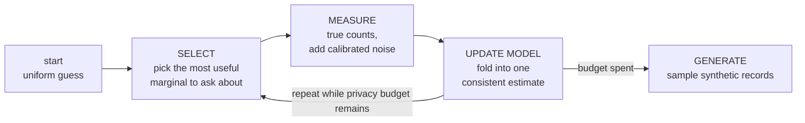
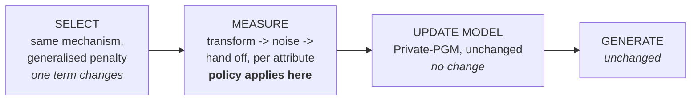
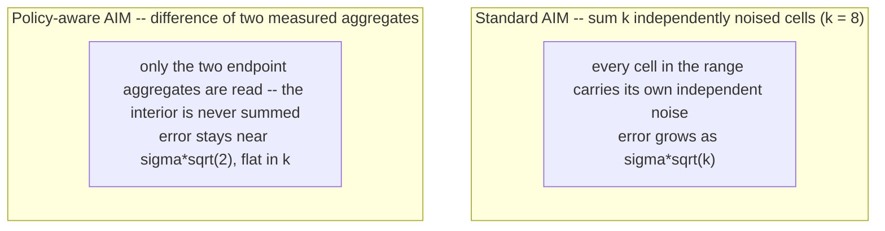

Consolidated specification · supersedes the policy, design and evaluation documents

# Policy-Aware AIM on the Adult dataset

A complete, self-contained specification for building a Blowfish-policy-aware variant of AIM, running it against stock AIM on the Adult census dataset, and reporting the comparison. It states every parameter needed to implement without further decisions, gives verified reference values for testing, and specifies the experiment and its metrics. Where a choice was previously left open, it is resolved here and marked.

### Contents

- [1. Objective and the claim under test](#1-objective-and-the-claim-under-test)
- [2. Background: AIM in one page](#2-background-aim-in-one-page)
- [3. Data and preprocessing](#3-data-and-preprocessing)
- [4. The policy, in full](#4-the-policy-in-full)
- [5. The mechanism: P_G](#5-the-mechanism-pg)
- [6. Algorithm modifications](#6-algorithm-modifications)
- [7. Sensitivity](#7-sensitivity)
- [8. Implementation plan](#8-implementation-plan)
- [9. Experiment protocol](#9-experiment-protocol)
- [10. Metrics](#10-metrics)
- [11. Reporting](#11-reporting)
- [12. Exact disclosure](#12-exact-disclosure)
- [13. Open items and risks](#13-open-items-and-risks)
- [14. Appendix: reference values](#14-appendix-reference-values)

## 1. Objective and the claim under test

Build a variant of AIM whose privacy guarantee is a **Blowfish policy** rather than standard differential privacy, and determine what that buys and what it costs on real data.

**The claim to be tested, stated precisely:**

Hypothesis At matched privacy budget, policy-aware AIM produces synthetic data that is **indistinguishable from stock AIM on cell-level marginal accuracy**, **measurably better on ordinal and range-shaped queries**, and carries a **bounded, enumerable disclosure cost** — namely exact release of which partition block each record falls in.

All three parts must be reported. The first is a no-regression check, the second is the payoff, the third is the price. A result that reports only the second is not a result.

The comparison is not symmetric — say so in the writeup Blowfish at `ε` guarantees strictly less than DP at `ε`: the neighbour relation is narrower, so fewer pairs of databases must look alike. An equal-`ε` accuracy win is therefore *expected* and is not by itself interesting. What makes it a finding is pairing it with Section 12's disclosure accounting and Section 10's inference-gap experiment, which together state exactly what was traded away.

## 2. Background: AIM in one page

AIM generates DP synthetic data by repeatedly measuring small marginals under noise and fitting a graphical model to the noisy answers. It never touches individual records — only **marginals**, small cross-tabs. The real `sex × income` marginal from Adult:

|  | income ≤ 50K | income > 50K |
|---|---|---|
| Female | 9,592 | 1,179 |
| Male | 15,128 | 6,662 |



AIM adds four refinements over the naive loop: a cheap head start measuring all 1-way marginals; a cap on candidate marginals that would make the model intractable; a selection score weighing workload relevance against remaining budget; and adaptive pacing that resizes rounds rather than fixing their number.

## 3. Data and preprocessing

Source: `dataset/adult.csv`, **32,561 records, 15 columns**. Preprocessing is deterministic and must be applied identically in both arms.

- **Drop `fnlwgt`** — a Census sampling weight, not information about the individual.
- **Drop `education`** — redundant with `education.num`, which is kept because it is already ordinal. Retaining both would double-count the attribute in every marginal.
- **Bin `capital.gain` and `capital.loss`** per Section 4.3. All other columns are used at native granularity.
- **Treat `"?"` as a real category, not a missing value.** In `workclass` and `occupation` the same 1,836 people carry `"?"` in both columns (100% co-occurrence); they work fewer hours (31.9 vs 40.9 average) and skew lower-income (89.6% vs 75.1% at ≤50K). This is genuine reduced labour-force attachment, not random missingness.

13 attributes remain. Domain sizes after preprocessing:

| Attribute | Meaning | Domain | Policy |
|---|---|---|---|
| age | Age in years at census time | 73 (17–90) | threshold θ=7 |
| workclass | Type of employer | 9 | partition ×4 |
| education.num | Highest education level, ordinal (1=Preschool … 16=Doctorate) | 16 (1–16) | threshold θ=2 |
| marital.status | Marital status | 7 | full |
| occupation | Job category | 15 | partition ×5 |
| relationship | Role within household | 6 | full |
| race | Race category | 5 | full |
| sex | Sex, as recorded | 2 | full |
| capital.gain | Capital gains reported | 7 bins (was 119) | threshold θ=2 |
| capital.loss | Capital losses reported | 6 bins (was 92) | threshold θ=2 |
| hours.per.week | Hours worked per week | 94 (1–99) | threshold θ=8 |
| native.country | Country of birth | 42 | partition ×5 |
| income | Whether income exceeds $50K/yr | 2 | full |

`income` is fully protected like everything else — it is *not* treated as a public label. This matters for Section 10: it makes income the fair choice of downstream prediction target.

## 4. The policy, in full

A Blowfish policy is a graph `G` per attribute, combined across attributes by the graph Cartesian product `G = H₁ □ H₂ □ … □ H₁₃`. Two databases are neighbours if one record moves along a single edge. Three graph types are in play:

G^attr

Full protection

Complete graph on the values. Any two indistinguishable — standard-DP strength. Works with any workload unchanged.

G^d,θ

Threshold

Edges between values within `θ`. Graph distance is `⌈|u−v|/θ⌉`. Protection degrades with distance.

G^P

Partitioned

Blocks of values, no edges across blocks. Within-block detail is protected; **block membership is disclosed exactly**.

#### 4.1 Full protection

`marital.status`, `relationship`, `race`, `sex`, `income`. Complete graph `K` on each domain. No implementation change from stock AIM on these axes — there is no useful notion of "nearby" to exploit.

#### 4.2 Partition blocks — exact membership

Every value of all three attributes is assigned. Strings are exactly as they appear in the CSV; note `Dominican-Republic` (not `Dominican-Rep.`) and `Outlying-US(Guam-USVI-etc)`.

workclass → 4 blocks

Government

4,351

- Federal-gov (960)
- State-gov (1,298)
- Local-gov (2,093)

Private

22,696

- Private (22,696)

Self-employed

3,657

- Self-emp-not-inc (2,541)
- Self-emp-inc (1,116)

NotClearlyEmployed

1,857

- Without-pay (14)
- Never-worked (7)
- ? (1,836)

`"?"` is merged here rather than kept separate, on the evidence in Section 3 item 4.

occupation → 5 blocks

WhiteCollar

16,554

- Prof-specialty (4,140)
- Exec-managerial (4,066)
- Adm-clerical (3,770)
- Sales (3,650)
- Tech-support (928)

BlueCollar

10,062

- Craft-repair (4,099)
- Machine-op-inspct (2,002)
- Transport-moving (1,597)
- Handlers-cleaners (1,370)
- Farming-fishing (994)

Service

4,093

- Other-service (3,295)
- Protective-serv (649)
- Priv-house-serv (149)

ArmedForces

9

- Armed-Forces (9)

UnknownOcc

1,843

- ? (1,843)

`"?"` stays its own block here — occupation has no "not employed"-shaped category to merge into. These are the same 1,836 people, so they remain protected on the workclass axis.

native.country → 5 blocks

US

29,170

- United-States

Americas

1,536 · 16 values

- Mexico, Canada, Puerto-Rico, Cuba, El-Salvador, Jamaica, Dominican-Republic, Guatemala, Columbia, Ecuador, Haiti, Nicaragua, Peru, Honduras, Trinadad&Tobago, Outlying-US(Guam-USVI-etc)

Europe

521 · 12 values

- Germany, England, Italy, Poland, Portugal, Greece, France, Ireland, Scotland, Yugoslavia, Hungary, Holand-Netherlands

Asia

751 · 12 values

- Philippines, India, China, Vietnam, Japan, Taiwan, Iran, Hong, Cambodia, Laos, Thailand, South

UnknownCty

583

- ?

`South` (80 records) is placed under Asia on the working assumption that it means South Korea — commonly assumed, not independently verified. Flagged rather than silently resolved.

#### 4.3 Threshold graphs and capital binning

A threshold graph on domain `{0…k−1}` has edge set `{(u,v) : |u−v| ≤ θ}`. Values used:

| Attribute | k | θ | Edges | Interpretation |
|---|---|---|---|---|
| age | 73 | 7 | 483 | Ages within 7 years indistinguishable |
| hours.per.week | 94 | 8 | 716 | Within 8 hours/week indistinguishable |
| education.num | 16 | 2 | 29 | Within 2 levels indistinguishable |
| capital.gain | 7 | 2 | 11 | Within 2 dollar-bands indistinguishable |
| capital.loss | 6 | 2 | 9 | Within 2 dollar-bands indistinguishable |

θ values lean wide rather than minimal: Blowfish range-query error scales as `log³θ`, so doubling θ costs about 2.3× error for up to 2× the protection width — not a 1:1 trade.

Resolved here: capital.gain / capital.loss bin edges Previously left open, which would block execution. Zero gets its own bin (91.7% / 95.3% of records sit at exactly $0), and `capital.gain`'s $99,999 top-coding spike gets its own top bin — it means "$99,999 or more", not a precise amount. Remaining edges are placed near quantiles of the nonzero mass. Revisable, but fixed for this experiment so both arms bin identically.

```
def bin_capital_gain(v):        # 7 bins
if v == 0:      return 0   # 29,849 records
if v < 3000:   return 1   #    472
if v < 5000:   return 2   #    592
if v < 8000:   return 3   #    797
if v < 15000:  return 4   #    238
if v < 99999:  return 5   #    454
return 6                     #    159  (top-coded)

def bin_capital_loss(v):        # 6 bins
if v == 0:      return 0   # 31,042 records
if v < 1500:   return 1   #    136
if v < 1800:   return 2   #    390
if v < 2000:   return 3   #    668
if v < 2300:   return 4   #    166
return 5                     #    159
```

## 5. The mechanism: P_G and transformational equivalence

`P_G` is the **signed vertex–edge incidence matrix** of the policy graph: one row per domain cell, one column per edge, carrying `+1` and `−1` at the two cells the edge joins. The central result (Design paper, Theorem 4.1) is:

W·x = W_G·x_G where x_G = P_G^−1x, W_G = W·P_G

Running a standard DP mechanism on `(W_G, x_G)` yields the Blowfish guarantee on `(W, x)`. The transform is lossless; all error comes from the noise. The theorem holds for *any* DP mechanism, so a better noise strategy can be substituted without giving up the guarantee.

#### 5.1 Worked example — `age × hours.per.week`

4 age bands × 2 hours bands (≤40 / >40) = 8 cells. Both threshold, so the policy graph is `L₄ □ K₂` — a 4×2 grid with **8 nodes and 10 edges** (`|E(A□B)| = |E(A)|·|V(B)| + |E(B)|·|V(A)| = 3·2 + 1·4`). Bounded DP is used, so `n` is public, one cell is recoverable by subtraction, and `Old/High` is folded into `⊥`. That leaves `x` as a 7-vector and `P_G` as **7×10**.

| symbol | shape | meaning |
|---|---|---|
| x | 7-vector | Marginal counts, folded cell dropped: `[10694, 3355, 8280, 4845, 3526, 1321, 480]` |
| G | 8 nodes, 10 edges | `L₄ □ K₂` |
| W | 7×7 | Workload. A measure round wants every cell back, so `W = I₇`. |
| P_G | 7×10 | Signed incidence matrix — rows are cells, columns are edges. |
| P_G^−1 | 10×7 | Minimum-norm right inverse `P_G^T(P_GP_G^T)^−1`. This is what Private-PGM receives. |
| x_G | 10-vector | `P_G^−1x` — the database as weights on *edges*. |
| W_G | 7×10 | `W·P_G`, which equals `P_G` when `W = I`. |

|  | ← 6 age edges (B_age ⊗ I₂) → | ← 4 hours edges (I₄ ⊗ B_hours) → |  |  |  |  |  |  |  |  |
|---|---|---|---|---|---|---|---|---|---|---|
| Young/Low | 1 | 0 | 0 | 0 | 0 | 0 | 1 | 0 | 0 | 0 |
| Young/High | 0 | 1 | 0 | 0 | 0 | 0 | −1 | 0 | 0 | 0 |
| Mid/Low | −1 | 0 | 1 | 0 | 0 | 0 | 0 | 1 | 0 | 0 |
| Mid/High | 0 | −1 | 0 | 1 | 0 | 0 | 0 | −1 | 0 | 0 |
| Sen/Low | 0 | 0 | −1 | 0 | 1 | 0 | 0 | 0 | 1 | 0 |
| Sen/High | 0 | 0 | 0 | −1 | 0 | 1 | 0 | 0 | −1 | 0 |
| Old/Low | 0 | 0 | 0 | 0 | −1 | 0 | 0 | 0 | 0 | 1 |

#### 5.2 Kronecker structure — why the full matrix is never built

The columns split into one block per attribute: that attribute's own incidence matrix, Kronecker'd with identities for the others — `[B_age ⊗ I₂ | I₄ ⊗ B_hours]`. The transform is therefore applied **one axis at a time** and the combined matrix is never materialised; its size is the product of every factor's size. For a 3-way marginal over `age × hours × education.num` the full `P_G` would be 109,792 columns wide.

Per-axis factor selection: `I_k` for a full-protection axis, the threshold incidence matrix for a threshold axis, the block incidence matrix for a partitioned axis. `P_GP_G^T` is then a Kronecker *sum* of graph Laplacians with a separable eigendecomposition, which is what makes the inverse tractable.

#### 5.3 One measurement round, numerically

`x_G = P_G^−1x` gives 10 edge weights:

| Y–M @Low | @High | M–S @Low | @High | S–O @Low | @High | hrs @Y | @M | @S | @O |
|---|---|---|---|---|---|---|---|---|---|
| 7316.5 | 6732.5 | 12803 | 14371 | 11967.5 | 20053.5 | 3377.5 | 2793.5 | 4361.5 | 12447.5 |

Two properties worth noting. **10 numbers represent 7** — the graph has more edges than vertices, so there is no unique inverse and the minimum-norm right inverse is used. And the values are **half-integers**: a 1-D line graph is a tree, giving clean prefix sums, but a 2-D grid has 4-cycles and the minimum-norm inverse spreads weight around them.

Where the structure pays off is a range-shaped query. Take `W = [1 0 1 0 0 0 0]` ("age Young or Mid, hours Low"):

| W_G = W·P_G | [0 0 1 0 0 0 1 1 0 0] — only 3 of 10 edge weights touched |
|---|---|
| W·x (true) | 18,974 |
| W_G·x_G | 18,974 — exact |

## 6. Algorithm modifications



#### 6.1 MEASURE — the only structural change

```
def measure(D, marginal r, sigma_t):
    # 1. Per-axis policy factors. Never materialise the Kronecker product.
factors = []
for attr in r.attributes:
if   policy[attr] is FULL:      factors.append(identity(dom[attr]))
elif policy[attr] is THRESHOLD: factors.append(threshold_incidence(dom[attr], theta[attr]))
elif policy[attr] is PARTITION: factors.append(block_incidence(blocks[attr]))
P_G     = kron_lazy(factors)            # kept as a factor list
P_G_inv = right_inverse(P_G)            # per-axis, then Kronecker

    # 2. Sensitivity: data-independent. Compute once per marginal shape, cache it.
Delta_r = max_col_L2(P_G_inv @ P_G)  # see Section 7

    # 3. Partitioned axes: block totals have sensitivity 0 — released exactly, no budget.
if any_partitioned(r):
emit_exact(block_totals(D, r))

    # 4. Transform, noise in the transformed space, hand off the PAIR.
x     = true_marginal(D, r)             # drop one cell: n is public (bounded DP)
x_G   = P_G_inv @ x
x_G  += gaussian(scale = sigma_t * Delta_r, size = x_G.shape)

return (P_G_inv, x_G)              # NOT a reconstruction of x
```

Do not reconstruct before handing off Passing `P_GW_G^−1x̃_G` back to cell space would make cell errors unequal and correlated, with covariance `P_GP_G^T`, which breaks Private-PGM's MLE. Noise on `x_G` is already isotropic, so plain least squares stays exact. Private-PGM supports general marginal query sets `Q_C` natively — identity is only its most common case, not a requirement.

#### 6.1.1 What Private-PGM must be handed

Measurements enter Private-PGM as a list of `(Q, y, noise_scale, clique)` tuples. Stock AIM passes `Q = I`; the only change is passing `Q = P_G^−1`. Shape contract for a marginal over cells `m` with `e` policy edges:

```
Q            : (e, m)   # P_G_inv -- taller than wide, e >= m
y            : (e,)     # noisy x_G
noise_scale  : scalar   # sigma_t * Delta_r, NOT sigma_t
clique       : tuple    # the marginal's attribute names, unchanged

# Assert before handing off -- these catch the two most likely bugs:
assert Q.shape == (e, m) and y.shape == (e,)
assert rank(Q.T @ Q) == m        # else the marginal is under-determined
# after one inference step, the gradient w.r.t. this clique must have dim m, not e
```

Why `e ≥ m` is expected, not a bug The policy graph has at least as many edges as vertices for every non-tree, so `x_G` is *larger* than the marginal it encodes — 10 numbers representing 7 in the Section 5 example. This is an over-determined least-squares system, which is exactly what Private-PGM's MLE handles. A rank check on `Q^TQ` is the correct test; comparing `e` to `m` is not.

#### 6.2 SELECT — one term generalised

```
# Stock AIM scores a candidate marginal r with a penalty term n_r = size of r's domain.
# Under a policy the released quantity is x_G, not x, so the penalty must reflect
# the actual reconstruction error of the strategy A_r = P_G_inv.

# stock:   penalty = n_r
# policy:  penalty = sum_i sqrt( inv(A_r.T @ A_r)[i,i] )

# Collapses to n_r exactly when A_r = I, so stock AIM is the special case.
# Apply the SAME replacement in the annealing / budget-pacing test, or pacing and
# selection will disagree about what a round costs.

# Under bounded DP the score's sensitivity becomes:
Delta_t = 2 * max(w_r for r in candidates)
```

#### 6.3 Design decisions

| # | decision | rationale |
|---|---|---|
| 1 | Pass measurements, not reconstructions | Hand Private-PGM the pair `(P_G^−1, x̃_G)`. Reconstruction correlates the noise and breaks the MLE. |
| 2 | L2 sensitivity, Gaussian noise, zCDP | Matches AIM. The sensitivity result holds in any norm. Threshold policies are retained for range-query quality, accepting near-parity on AIM's cell-level metric. |
| 3 | Bounded DP — `n` is public | AIM defaults to unbounded, but its 1.13× unbounded advantage requires `Δ₂=1` from pure add/remove, unavailable once substitution edges exist. Unbounded also destroys the free block totals, which need fixed `n`. Net across the policy: bounded wins 1.14×. |
| 4 | Generalised SELECT penalty | See 6.2. Correct as specified, but see the known limitation in Section 13. |
| 5 | Budget accounting unchanged | AIM writes the Gaussian mechanism as `f(D) + σ·Δ(f)·N(0,I)`, so `σ` multiplies sensitivity and the zCDP cost `1/(2σ²)` is already sensitivity-agnostic. Only the noise scale changes. |
| 6 | Partition only three attributes | Five partitioned attributes give 600 components and 21 singletons; three give 100 and 2, for 1.11× against 1.15×. The extra 4% is not worth a tenfold rise in uniquely-identified people. |

## 7. Sensitivity

Neighbouring databases differ by exactly one column of `P_G`, so for a released quantity `x_G` the L2 sensitivity is

Δ₂ = max over edges e of ‖ P_G^−1 · P_G[:, e] ‖₂ = max column L2 norm of P_G^−1P_G

It is **independent of the data** — computable from the policy alone, before touching any records, at zero privacy cost. Compute it once per marginal *shape* and cache. For a tree policy graph `P_G^−1P_G = I` exactly, giving sensitivity 1; cycles lower it below 1, because the projection onto a lower-dimensional row space shortens the columns.

#### Reference values — deployed policy, 1-way

Δ₂ is not a quality measure — read the error column, not the sensitivity Δ₂ *falls* as θ grows while total cell error *rises*, because the edge count grows faster than Δ² shrinks. A wider θ is stronger protection and costs more accuracy, exactly as intended. Δ₂ only calibrates noise per released number; it says nothing about how many numbers are released. Never compare policies by Δ₂ alone.

| attribute | k | θ | edges | Δ₂ | rel. cell error |
|---|---|---|---|---|---|
| age | 73 | 7 | 483 | 0.4872 | 1.26× |
| hours.per.week | 94 | 8 | 716 | 0.4604 | 1.27× |
| education.num | 16 | 2 | 29 | 0.7862 | 1.11× |
| capital.gain | 7 | 2 | 11 | 0.7862 | 1.11× |
| capital.loss | 6 | 2 | 9 | 0.7862 | 1.11× |
| any, θ=1 (path) | any | 1 | k−1 | 1.000000 | 1.00× |

Relative cell error is `√(Δ²·2|E|)` normalised to the θ=1 case, i.e. the error of estimating the whole 1-way marginal at fixed `σ`. The full trend for `age`: θ=1 → 1.00×, θ=3 → 1.17×, θ=7 → 1.26×, θ=15 → 1.28×, while Δ₂ falls 1.000 → 0.349 across the same range.

Correction carried forward from the previous design document Its sensitivity table listed the 2-way grid example as **1.93 under policy against 4 for standard DP**. Those are **L1** values sitting in a table that is otherwise L2, inside a design that specifies Gaussian/L2 noise throughout. The correct L2 figures for that example, verified against the matrix, are **0.856 under policy against 1.369 standard** — a ratio of 1.60×, not 2.07×.

This matters for implementation: calibrating Gaussian noise to 1.93 instead of 0.856 would inject **2.25× more noise than required** and silently erase the policy's advantage. Use the formula above and compute; do not hard-code table values. The related shorthand that "L2 gains are the square root of L1 gains" is a heuristic and does not hold exactly here (`√2.074 = 1.440`, actual `1.600`).

#### What the policy buys, by released quantity

| released quantity | standard DP | under policy | note |
|---|---|---|---|
| raw marginal | √2 | √2 | No change. A raw marginal records *which* cells moved, never *how far* — it is blind to distance. |
| running totals, 1-way threshold | √(k−1) | 1 | Tree graph, exact. |
| x_G, 2-way grid example | 1.369 | 0.856 | L2, verified. 1.60×. |
| block totals, partitioned | √2 | 0 | Released exactly, zero budget. |

The gain exists only in the transformed space. Section 10 exists because of the gap between what AIM measures and where that gain lives.

Always state the norm when quoting a gain Ratios in variance and in error differ by a square root, and quoting one for the other overstates the result by up to 9×. Verified figures for `age` (θ=7, k=73) at the measurement level, at matched `σ`:

| quantity | variance ratio | error ratio |
|---|---|---|
| cell-level (AIM's metric) | ~1.04× | ~1.02× |
| range query, width 20 | 3.22× | 1.80× |
| range query, full domain | 86.67× | 9.31× |

The "up to 25×" figure quoted in earlier drafts had no norm attached and sat between these two. **Report error ratios**, matching the L1/L2 metrics in Section 10, and label any variance ratio explicitly.

## 8. Implementation plan

Build order is chosen so each phase is testable against the reference values in Section 14 before the next depends on it.

P0

Environment

`numpy`, `scipy`, `pandas`, `scikit-learn`, `pot` or `scipy.stats.wasserstein_distance`. Clone Private-PGM (`github.com/ryan112358/private-pgm`) which ships a reference AIM implementation — that is the stock-AIM arm and the base to fork. **None of these are currently installed**; the environment is bare Python 3.

P1

Preprocessing + policy objects

Implement Section 3 preprocessing and Section 4 policy as data: per-attribute graph type, θ, block maps, bin functions. Assert domain sizes and block totals match Section 4 exactly.

P2

P_G construction and inverse

Per-axis incidence matrices, lazy Kronecker, minimum-norm right inverse. **Test against Section 14**: the 7×10 matrix, `x_G`, `W_G`, and `W·x = W_G·x_G = 18,974`.

P3

Sensitivity module

Section 7 formula, cached per marginal shape. **Test**: θ=1 path graph must return exactly 1.0; the five deployed attributes must return the Section 7 values.

P4

Modified MEASURE

Section 6.1. Verify Private-PGM accepts `(P_G^−1, x̃_G)` — check `A^TA` is invertible and the gradient has the cell-space dimension. Emit block totals exactly for partitioned axes.

P5

Modified SELECT

Section 6.2, in both the selection score and the annealing test. **Test**: with an all-full-protection policy the penalty must equal `n_r` and the whole pipeline must reproduce stock AIM.

P6

Metric harness

Section 10, computed on generated synthetic data. Build before running experiments so the first full run produces usable output.

P7

Experiment sweep and report

Sections 9 and 11.

The strongest single correctness test Set every attribute to full protection. `P_G` becomes the incidence matrix of a complete graph, the SELECT penalty collapses to `n_r`, and policy-aware AIM must reproduce stock AIM to within Monte-Carlo noise. If it does not, the bug is in the transform, not the policy.

## 9. Experiment protocol

two armsStock AIM and policy-aware AIM, identical preprocessing, identical workload, identical hyperparameters — rounds, α, budget split, max model size. *Otherwise the experiment compares configurations, not policies.*

sweep ρFive zCDP budget points, geometric ×4, never a single value. *The gain is largest where noise dominates, so one mid-range ρ can badly under- or over-sell it.*

≥10 seedsPer arm per budget point. Report mean ± sd or box plots. *Run-to-run variance in AIM is high enough that single-run comparisons carry no information.*

workloadAll 3-way marginals, matching AIM's own evaluation, so Tier A is comparable to published numbers.

measure x̂Every utility metric is computed on the **generated synthetic data**, never on the noisy measurements. *Measuring at the wrong point would credit the policy with a gain that may not survive Private-PGM inference.*

logPer-round: marginal selected, budget spent, Δ_r used, model size. *Needed to diagnose the SELECT bias in Section 13.*

#### 9.1 Budget points

Geometric ×4, centred so the middle point sits near `ε ≈ 1` — the region AIM's own evaluation occupies. Conversion is `ε = ρ + 2√(ρ·ln(1/δ))` at `δ = 10^−9`, reported for reference only; **the experiment is run and reported in ρ**.

| ρ | 0.000625 | 0.0025 | 0.01 | 0.04 | 0.16 |
|---|---|---|---|---|---|
| ε @ δ=1e-9 | 0.23 | 0.46 | 0.92 | 1.86 | 3.80 |

#### 9.2 Hyperparameters

Every value below must be **identical across both arms** and recorded in the run log. Where a value is marked *pin from reference*, read it off the Private-PGM AIM implementation at the commit used and write it into the log — do not assume a default, and do not let the two arms pick it independently.

| parameter | value | note |
|---|---|---|
| workload | all 3-way marginals | 286 marginals over 13 attributes, uniform weights. |
| max_model_size | 80 MB | AIM's stated default. Binds when the model grows too large; must match or the arms explore different candidate sets. |
| degree | 3 | Matches the workload. |
| rounds / pacing | *pin from reference* | AIM sets rounds adaptively via budget annealing. Pin the rule, not a round count. |
| α (annealing) | *pin from reference* | Must use the **generalised** penalty (Section 6.2) in both the score and the annealing test. |
| 1-way warm start | enabled, same fraction | AIM's cheap head start over all 1-way marginals. |
| seeds | 0–9 | Same ten seeds per arm per budget point: 2 arms × 5 ρ × 10 seeds = **100 runs**. |

## 10. Metrics

Read this before choosing metrics AIM scores itself on average workload error over 3-way marginals, measured cell by cell. Cell-level error is precisely what the threshold policy does *not* improve — about 1.02×. **An evaluation built only on AIM's native metric will report that the policy does nothing.** That is a property of the metric, not the algorithm: the policy moves error out of range and aggregate queries, which a cell-wise marginal metric never asks about.

#### 10.1 Why range queries improve



Stated honestly `σ√2` is the idealised path-graph case. The deployed graphs are **θ-band** graphs, so `P_G` holds windowed aggregates rather than clean prefix sums and graph distance is `⌈|u−v|/θ⌉`. The consequence is concrete: **the gain should appear only for ranges wider than θ**, and `√(k/2)` is an upper bound, not a prediction.

#### 10.2 Tier A — no regression

| metric | definition | expected |
|---|---|---|
| Workload error | Mean over all 3-way marginals of `‖W_rx − W_rx̂‖₁ / n`. AIM's native metric. | ~1.0× |
| Max workload error | Worst single marginal. AIM optimises for this, so a regression here matters more than the mean. | ~1.0× |
| TV distance | Total variation on 1-, 2- and 3-way marginals. Report the distribution across marginals, not a single mean. | ~1.0× |

Below `0.9×` indicates a bug in the sensitivity calculation, not a result. TV belongs here rather than in Tier B because it treats age 25 and 26 as maximally different — exactly the distinction the threshold policy declines to preserve.

#### 10.3 Tier B — where the gain lives

| metric | definition | expected |
|---|---|---|
| Range query error, width < θ | See the benchmark specification below. | 1.2–1.4× worse |
| Range query error, width > θ | Same benchmark, wide strata. This is the primary result. | the claim |
| Wasserstein-1 | Earth-mover distance per ordinal attribute. Unlike TV it respects the ordinal structure the threshold policy is built to preserve. | the claim |
| Small-count cell error | Mean relative error over cells of the attribute's **1-way** marginal whose **true** count is below `0.001n = 32.6` records. Fixed per attribute from the real data, not recomputed per run. | the claim |

Narrow ranges are a genuine regression, not parity Earlier drafts recorded `~1.0×` below θ. The verified figure is **worse than parity**: for `age` the variance ratio is 0.69× at width 2 and 0.81× at width 4, i.e. the policy is about 1.2× worse in error. This is expected — a θ-band graph spends its budget describing windowed aggregates, so the narrowest queries pay for structure they do not use. Reporting an unstratified range-query average would let this cancel the wide-range gain and produce a null result.

##### Benchmark specification

- **1-D: exhaustive, no sampling.** Every interval on every ordinal attribute — `age` 2,701, `hours.per.week` 4,465, `education.num` 136, `capital.gain` 28, `capital.loss` 21. **Total 7,351 queries**, cheap to evaluate and free of sampling variance.
- **2-D: 2,000 random rectangles per attribute pair**, over the pairs `(age, hours)`, `(age, education.num)`, `(hours, education.num)`. Sample each axis by drawing `lo < hi` uniformly from that axis's interval set. Fix the seed and use the **same rectangles for both arms**.
- **Width strata, normalised to θ** so they are comparable across attributes: `[1, θ/2]`, `(θ/2, θ]`, `(θ, 2θ]`, `(2θ, 4θ]`, `> 4θ`. Report mean and max L1 error per stratum, per arm.
- **Report the ratio per stratum**, never a single pooled number.

##### Predicted crossover — use this to validate the pipeline

Computed from the policy alone at matched `σ`, at the measurement level. Error ratios, >1 means the policy wins:

| width | age (θ=7) | hours (θ=8) | education.num (θ=2) |
|---|---|---|---|
| 2 | 0.83× | 0.82× | 1.09× |
| 4 | 0.90× | 0.88× | 1.55× |
| 7 | 1.06× | 1.00× | 2.09× |
| 8 | 1.13× | 1.05× | 2.25× |
| 15 | 1.55× | 1.44× | 4.93× |
| 20 | 1.80× | 1.66× | — |
| 40 | 2.59× | 2.38× | — |
| 55 | 3.16× | 2.83× | — |

This is a falsifiable prediction, and the best end-to-end check available The crossover sits at width ≈ θ for every threshold attribute — 7 for `age`, 8 for `hours`, below 2 for `education.num`. **If the measured curve does not cross near θ, the implementation is wrong**, most likely in `P_G^−1` or in the sensitivity calibration. Measured gains should fall *below* these numbers — they are measurement-level and Private-PGM's constrained fit is expected to compress them — but the crossover location should survive.

The cleanest available evidence is a dissociation Wasserstein-1 improves while TV distance does not. The two differ *only* in whether they respect ordinal distance, so a gap between them isolates the policy's effect from everything else in the pipeline.

**Two data-specific cautions, from the actual columns:**

- `hours.per.week` is spiked at 40 (Q1 and median are both 40). A uniform random-interval benchmark there really measures "did the interval contain cell 40", which is a cell-count question in disguise. **Use `age` as the primary range-query attribute**; report hours secondarily with the spike noted.
- 12 of 73 `age` cells and 48 of 94 `hours` cells hold under 0.1% of mass. These are noise-dominated under stock AIM and are where the policy's smoothing should show up most — hence the small-count metric.

#### 10.4 Tier C — downstream utility

TSTR (train on synthetic, test on real) predicting `income`. Report **AUC and F1, not accuracy** — the split is 75.9% / 24.1%, so a constant predictor scores 76%. Use at least three model families (logistic regression, gradient boosting, random forest); a single model can mask differences in either direction. Baselines: train-real-test-real for the ceiling, a marginal-only sampler for the floor.

Keep every downstream target in the full-protection set `income`, `sex`, `race`, `marital.status`, `relationship`. Benchmarking on a threshold or partitioned attribute would measure "we protected it less, so we predict it better", which is circular. Expect parity here; a Blowfish win at TSTR is a bonus, not the thesis.

#### 10.5 Tier D — the privacy price

| measurement | definition | expected |
|---|---|---|
| Exact disclosure | Structural, already computed — see Section 12. | known cost |
| Exact-value inference | Attacker recovers a threshold attribute's precise value from the synthetic data. | ~1.0× |
| Coarse-value inference | Attacker recovers the same attribute to within θ. | worse |

##### Attack methodology

Run identically against both arms, on the models the main sweep already fits — no extra runs.

| attack | procedure | reported |
|---|---|---|
| Attribute inference (exact vs coarse) | Train a gradient-boosted classifier on the **synthetic** data to predict a threshold attribute from the other 12. Evaluate on the **real member half**. Score twice from the same predictions: **exact** = predicted value equals true value; **coarse** = predicted value within θ of true. Run for `age`, `hours.per.week` and `education.num`. | Accuracy for each, per attribute, per arm. **The exact–coarse gap is the headline number**, not either score alone. |

A baseline is required: run the same model against **real** held-out records to establish the ceiling. Attribute-inference accuracy on synthetic data is only meaningful relative to what the same model achieves on real data.

The inference-gap experiment is the sharpest instrument here Splitting attribute inference into *exact* and *within-θ* recovery maps directly onto what the policy does and does not promise — it explicitly declines to protect coarse age. The expected result, comparable exact-inference success alongside measurably higher coarse-inference success, *is* the price, quantified. Reporting it is what makes the accuracy claim credible rather than a sleight of hand.

## 11. Reporting

The headline table. The story it should tell: *parity on everything AIM was already good at, improvement on ordinal and aggregate queries, and an explicit statement of what was given up.*

| metric | stock AIM | Blowfish AIM | ratio | role |
|---|---|---|---|---|
| 3-way marginal L1 | — | — | ~1.0× | no regression |
| Range queries, width < θ | — | — | 0.8–0.9× | expected regression |
| Range queries, width ≫ θ | — | — | the claim | the gain |
| Wasserstein-1, ordinal | — | — | the claim | the gain |
| Small-count cells | — | — | the claim | the gain |
| TSTR AUC, income | — | — | ~1.0× | no regression |
| Exact-value inference | — | — | ~1.0× | no new leak |
| Coarse-value inference | — | — | worse | disclosed price |

Alongside the table, report:

- **A CDF of per-query error ratio** — the single most informative plot. An aggregate can hide that three queries improved 25× while four hundred degraded slightly.
- **Range-query ratio against interval width**, with θ marked. This is the direct test of the Section 10.1 mechanism.
- **Error against ρ** for both arms, to show where in the budget range the gain concentrates.
- **The Section 12 disclosure table**, unmodified — it is part of the result, not an appendix.

## 12. Exact disclosure

Partitioning is the one place this design gives up something differential privacy never would. With `c` connected components an adversary learns exactly which component every record belongs to — published in the clear, no noise, no budget. Measured on the real data at the chosen setting (`workclass × occupation × native.country` = 4×5×5):

| components | non-empty | median bucket | singletons | buckets ≤5 |
|---|---|---|---|---|
| 100 | 55 | 52 | 2 (0.006%) | 6 (11 people, 0.034%) |

The two singleton buckets are `(NotClearlyEmployed, Service, US)` and `(NotClearlyEmployed, WhiteCollar, Asia)` — each holding one person, uniquely identified by disclosed information.

#### Why three partitioned attributes and not five

| partitioned attributes | buckets | singletons | ≤5 people | accuracy |
|---|---|---|---|---|
| none | 1 | 0 | 0 | 1.00× |
| workclass | 4 | 0 | 0 | 1.03× |
| + occupation | 20 | 1 | 4 | 1.07× |
| **+ native.country ← adopted** | **100** | **2** | **11** | **1.11×** |
| + capital.gain, capital.loss (rejected) | 600 | 21 | 152 | 1.15× |

Residual risk Exact disclosure compounds with correlations an adversary already holds. Someone known to work in government, white-collar, born in Europe is narrowed considerably — before the synthetic data is consulted at all. This is a property of the policy, not of any implementation, and cannot be mitigated by spending more budget.

## 13. Open items and risks

⚠

**BLOCKER — `P_G^−1` has no specified algorithm.** `P_G = [B₁⊗I | I⊗B₂]` is a *concatenation* of Kronecker products, not a Kronecker product, so there is no per-axis decomposition of its inverse. `P_GP_G^T = L₁⊗I + I⊗L₂` is a Kronecker sum and *is* separably diagonalisable — but only before the bounded-DP row drop; after the drop it is a principal submatrix of that, which is not. Materialising is not an alternative: `age × hours` alone needs a 5.4 GB dense `P_G`, and `age × hours × education.num` needs 1.5 TB. **Phase P2 cannot start until this is decided**, and P3–P7 all depend on P2.

⚑

**Does the gain survive Private-PGM inference?** The advantage is created at MEASURE, but the deliverable is synthetic data produced by projection onto a graphical model. Whether the range-query advantage persists through that projection is the largest open question here, and the reason every utility metric is computed on `x̂`. AIM's own ablations suggest the constrained fit compresses such differences by roughly 3×.

⚑

**The 25× figure is an upper bound.** Measured on the worked example at the measurement level, not end to end. Treat it as a ceiling the experiment tests, not a target.

⚑

**SELECT will under-pick threshold marginals.** The generalised penalty is roughly 1.4× larger for them, so budget steers away from exactly the attributes whose policy was adopted for range-query quality. Correct as specified, but the score measures cell error and has no way to express the range-query benefit. Log per-marginal selection counts in both arms as a diagnostic. Fixing it properly requires workloads of general linear queries — an open problem in the AIM paper.

⚑

**Cross-marginal strategy coordination.** Each marginal's measurement is handled well in isolation; coordinating strategy and budget across the many overlapping marginals AIM selects over a full run is unsolved in both source papers. Proceeding with per-marginal Kronecker strategies.

⚑

**`native.country = "South"`** assumed to mean South Korea and placed under Asia. Unverified; affects 80 records.

✓

**Resolved:** capital.gain / capital.loss bin edges (§4.3); the L1/L2 sensitivity mislabelling (§7); Δ₂ presented without its error column (§7); "parity below θ" corrected to an expected regression (§10.3); un-normed gain ratios (§7); ρ sweep and hyperparameters (§9.1, §9.2); range-query benchmark (§10.3); small-count cell definition (§10.3); attack methodology (§10.5); Private-PGM shape contract (§6.1.1).

## 14. Appendix: reference values for testing

All values below were computed with exact rational arithmetic against the real dataset and reproduce exactly. Use them as unit tests for phases P1–P3.

#### Dataset invariants

```
n                       = 32561
income                  = {'<=50K': 24720 (75.9%), '>50K': 7841 (24.1%)}
age                     : 73 distinct, 17..90,  quartiles 28 / 37 / 48
hours.per.week          : 94 distinct,  1..99,  quartiles 40 / 40 / 45
education.num           : 16 distinct,  1..16,  quartiles  9 / 10 / 12
capital.gain            : 29849 zeros (91.7%), 159 at 99999
capital.loss            : 31042 zeros (95.3%)
workclass '?'           = 1836,  occupation '?' = 1843,  both = 1836
sex x income            = [[9592, 1179], [15128, 6662]]   # F/M x <=50K/>50K
```

#### Policy objects

```
workclass blocks        = {Government: 4351, Private: 22696,
Self-employed: 3657, NotClearlyEmployed: 1857}
occupation blocks       = {WhiteCollar: 16554, BlueCollar: 10062, Service: 4093,
ArmedForces: 9, UnknownOcc: 1843}
native.country blocks   = {US: 29170, Americas: 1536, Europe: 521,
Asia: 751, UnknownCty: 583}
disclosure buckets      = 100 total, 55 non-empty, median 52, 2 singletons
singletons              = [(NotClearlyEmployed, Service, US),
(NotClearlyEmployed, WhiteCollar, Asia)]
```

#### P_G transform — `age × hours` worked example

```
x       = [10694, 3355, 8280, 4845, 3526, 1321, 480]        # 7-vector
P_G     : 7 x 10   # see Section 5.1 for the full matrix
P_G @ P_G_inv == I_7                                         # must hold exactly

x_G     = [7316.5, 6732.5, 12803.0, 14371.0, 11967.5,
20053.5, 3377.5, 2793.5, 4361.5, 12447.5]         # 10-vector

W       = [1, 0, 1, 0, 0, 0, 0]                              # range query
W_G     = W @ P_G = [0, 0, 1, 0, 0, 0, 1, 1, 0, 0]
W @ x   == W_G @ x_G == 18974                                # exact, lossless
```

#### Sensitivity

```
# Delta_2 = max column L2 norm of (P_G_inv @ P_G)
theta=1 path graph, any k          -> 1.000000   # tree, exact
age            k=73 theta=7        -> 0.4872
hours.per.week k=94 theta=8        -> 0.4604
education.num  k=16 theta=2        -> 0.7862
capital.gain   k=7  theta=2        -> 0.7862
capital.loss   k=6  theta=2        -> 0.7862

# 2-way grid example (age x hours, 4x2):
policy   L2 = 0.8557   L1 = 1.9286
standard L2 = 1.3693   L1 = 4.0000
ratio    L2 = 1.600x   L1 = 2.074x       # use L2 -- Gaussian mechanism

# Delta_2 falls with theta but CELL ERROR RISES -- sqrt(Delta^2 * 2|E|), age k=73:
theta   1   2   3   5   7  10  15
Delta  1.000 .786 .680 .559 .487 .418 .349
err    1.00x 1.11x 1.17x 1.23x 1.26x 1.28x 1.28x
```

#### Predicted range-query crossover

```
# error ratio at matched sigma, measurement level; >1 = policy wins
# width:      2      4      7      8     15     20     40     55
age    th=7  0.83   0.90  1.06   1.13   1.55   1.80   2.59   3.16
hours  th=8  0.82   0.88   1.00  1.05   1.44   1.66   2.38   2.83
edu    th=2  1.09   1.55   2.09   2.25   4.93     -      -      -

# crossover sits at width ~= theta for every attribute.
# if the measured curve does not cross near theta, the implementation is wrong.
```

Consolidated design and execution specification for policy-aware AIM on the Adult census dataset (32,561 records). Supersedes `policy/adult-policy-spec.html`, `aim/aim-algorithm-explainer.html` and `evaluation/evaluation-plan.html`. Builds on: AIM (McKenna, Mullins, Sheldon, Miklau, VLDB 2022); Blowfish Privacy (He, Machanavajjhala, Ding, SIGMOD 2014); Design of Policy-Aware Differentially Private Algorithms (Haney, Machanavajjhala, Ding, 2015); Private-PGM (McKenna, Sheldon, Miklau, ICML 2019); the Matrix Mechanism (Li, Hay, Rastogi, Miklau, McGregor, PODS 2010).
